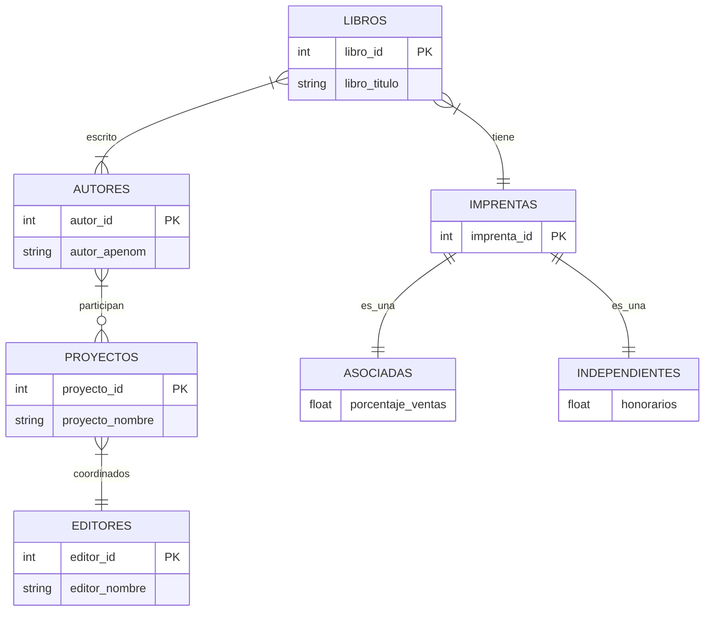

# Editorial

* Ediciones CPU trabaja con muchos autores diferentes que escriben libros para la editora. Algunos autores escribieron un solo libro, mientras que muchos escribieron más de uno; además algunos libros han sido escritos por más de un autor. 
* La empresa trabaja con múltiples imprentas, algunas están asociadas por lo que reciben un porcentaje de las ventas de cada libro mientras que otras son independientes y cobran honorarios por cada trabajo realizado. Se maneja información distinta para cada tipo de imprenta aún antes de que impriman su primer libro, lo que le permite a la empresa contar con información de proveedores posibles y no sólo con los que ya imprimieron algún libro. Cada libro es asignado a una sola imprenta.
* Cada editor que trabaja para la compañía coordina varios proyectos a la vez, aunque cada proyecto tiene asignado un solo editor. En cada proyecto participan uno o varios autores y puede suceder en algún momento que un autor no esté trabajando en ningún proyecto.

