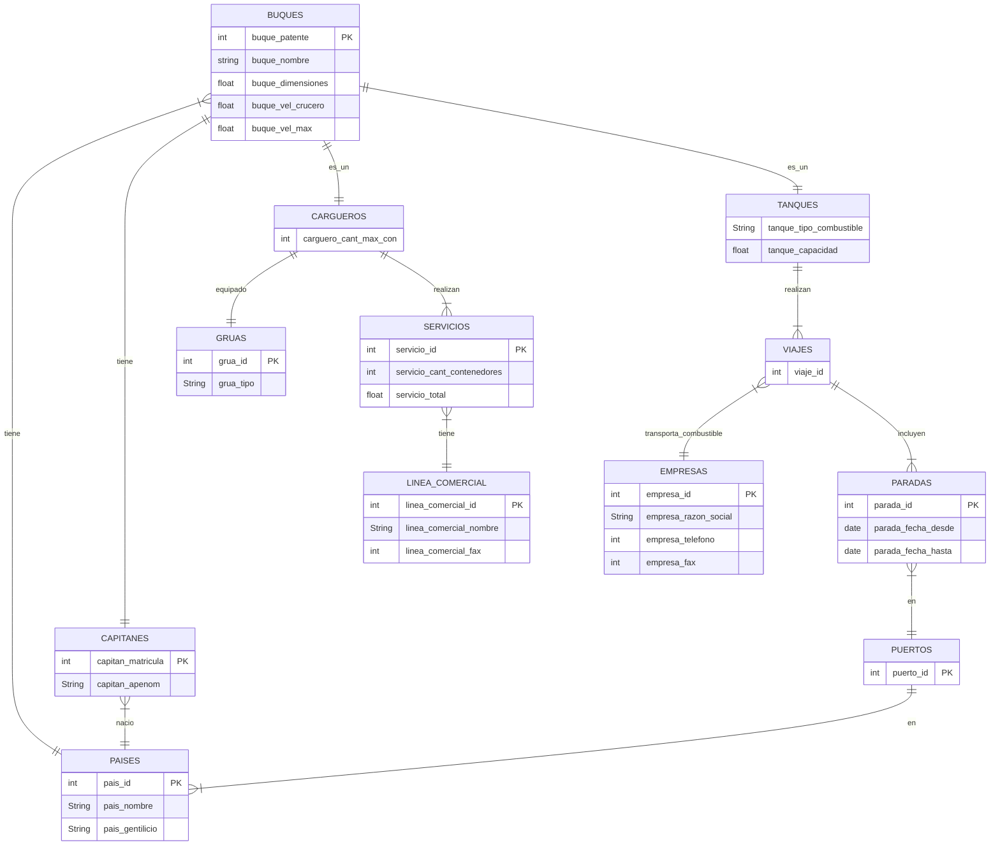

# Buques

* Una importante compañía naviera, la decimoquinta a nivel mundial, tiene una flota de más de 500 buques, todos identificados por un número de patente, nombre, la bandera del país, dimensiones (eslora, calado, tonelaje), velocidad crucero y una velocidad máxima.
* Cada barco tiene un capitán que debe estar matriculado, se conoce su apellido y nombre y su nacionalidad.
* La compañía naviera trabaja con dos tipos de clientes: empresas de combustible y líneas comerciales.  De las primeras existe un catálogo internacional donde figuran la identificación, la razón social, sus teléfonos y el número de fax.  De las segundas, cada país codifica sus líneas e informa sus nombres y números de fax.
* Los buques pueden ser de varios tipos (cargueros de contenedores, tanques, cerealeros o de pasajeros). Los cargueros pueden o no estar equipados con un tipo de grúa (codificación internacional) y tienen una cantidad máxima de contenedores.
* Los tanques son clasificados según el tipo de combustible que transportan (codificación de la compañía) y se conoce su capacidad en litros. Realizan viajes transportando combustible para distintas empresas, aunque en cada viaje lo hacen para una sola.
* Los viajes se numeran secuencialmente y pueden incluir más de una parada en cada puerto,  pagando en cada uno de ellos un costo por tonelada y por día, conociéndose además la fecha desde y hasta de cada parada.
* La compañía numera los servicios que realizan sus cargueros.  Cada servicio se factura por un total y se registra la línea comercial, el buque carguero y la cantidad de contenedores transportados.  
* Cada país numera sus puertos.

