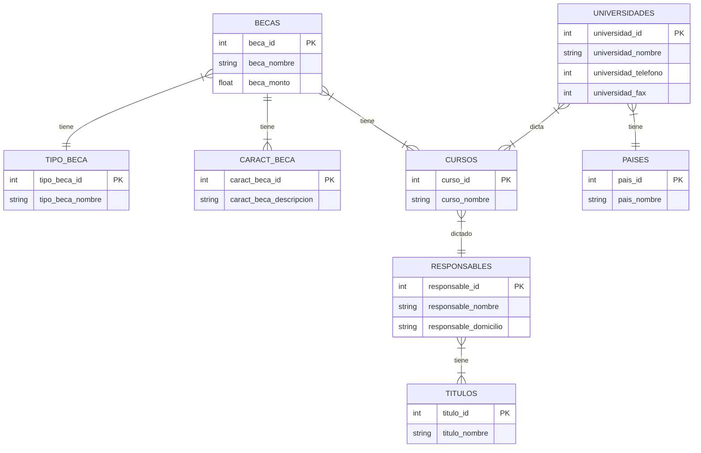

# Becas RCI

* Las Universidades extranjeras conceden un número de becas para cada uno de los cursos que dictan, por ello el Instituto de Orientación al Estudiante guarda registro de las becas disponibles en todo el mundo.
* Cada beca tiene un código de identificación único dado por cada universidad extranjera y puede incluir varios cursos.
* Cada universidad tiene un código de identificación único de carácter internacional, sus otros datos son: el país al que pertenece, el nombre de la universidad, los teléfonos y el domicilio de la universidad.
* De los cursos interesa su código de identificación (asignado por cada universidad), el nombre del curso, la fecha de dictado, la beca ofrecida y el número de becas disponibles, el responsable del curso, el domicilio del responsable y todos sus títulos.
* De cada beca se desea conocer el tipo de beca (total, parcial, individual, grupal), el nombre de la beca, el monto de la beca y las características que pueden variar entre 1 y 15 (están definidas a través de un código único y de una descripción).
 

