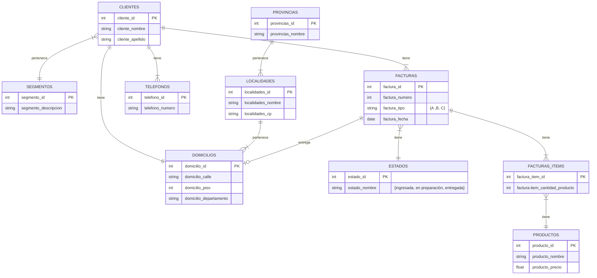

# TP

## Enunciado

* En base a la estructura presentada se solicita:

  1. Redefinir la estructura eliminando o incorporando atributos
  2. Llevar la estructura a 3ra forma normal
  3. Desarrollar el diagrama de entidad relación
  4. Crear las tablas mediane instrucciones SQL
  5. Poblar las tablas con al menos 20 filas en su tabla principal mediane instrucciones SQL
  6. Mediante instrucciones SQL crear un Dataset que unifique las tablas, luego exportarlo como TXT o CSV
  7. Crear un Dataset que agrupe las compras de un CLIENTES, totalizando los montos de las compras
  8. Crear un Dataset que agrupe las compras por estados, totalizando los montos de las compras

* Estructura:
  * CLIENTES ID (Clave que identifica de forma unívoca al CLIENTES)
  * Nombre CLIENTES (Incluye: nombre y apellido)
  * Dirección CLIENTES (incluye: Calle, Nro, Piso, Departamento, CP, LOCALIDADES, PROVINCIAS)
  * Teléfono CLIENTES \* (puede tener más de uno)
  * SEGMENTOS ID (Clave que identifica los distintos SEGMENTOSs de CLIENTES)
  * Descripción de SEGMENTOS
  * Tipo de FACTURAS (A-B-C)
  * Nro de FACTURAS (Nro secuencial único para cada tipo de FACTURAS)
  * Fecha FACTURAS
  * Detalle FACTURAS \* (pueden existir entre 1 y 30 ítems)
    * PRODUCTOS ID (Clave que identifica de forma unívoca un PRODUCTOS)
    * Nombre PRODUCTOS
    * Precio PRODUCTOS
    * Cantidad
  * Total FACTURAS (surge de la sumatoria de los ítems del detalle de la FACTURAS)
  * Bonificación importe (se determina en base a SEGMENTOS del CLIENTES)
  * Estado FACTURAS ID (Clave que identifica los estados de una FACTURAS)
  * Descripción estado FACTURAS (ingresada, en preparación, entregada)
  * Dirección entrega PRODUCTOSs (puede ser nulo)

## DER

[Mermaid](https://mermaid.js.org/syntax/entityRelationshipDiagram.html)

## SQL - create

## SQL - insert

## SQL - exportación txt/csv

## DATASET agrupe compras de un CLIENTES, totalizando montos

## DATASET agrupe compras por estados, totalizando montos
