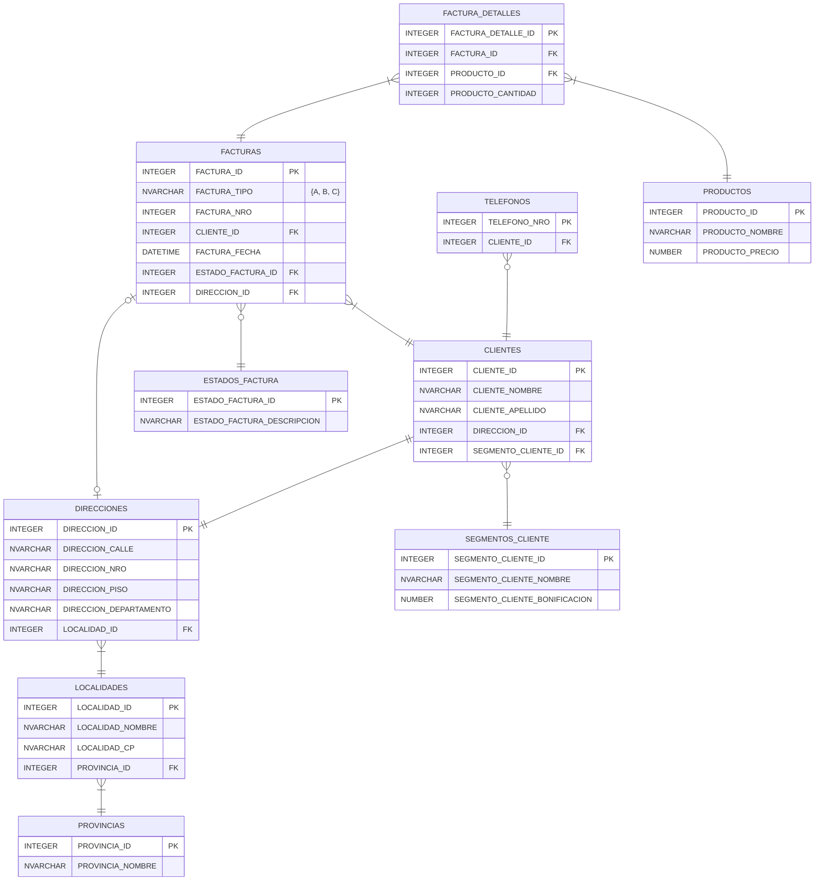

# TP

## Enunciado

* En base a la estructura presentada se solicita:

  1. Redefinir la estructura eliminando o incorporando atributos
  2. Llevar la estructura a 3ra forma normal
  3. Desarrollar el diagrama de entidad relación
  4. Crear las tablas mediane instrucciones SQL
  5. Poblar las tablas con al menos 20 filas en su tabla principal mediane instrucciones SQL
  6. Mediante instrucciones SQL crear un Dataset que unifique las tablas, luego exportarlo como TXT o CSV
  7. Crear un Dataset que agrupe las compras de un CLIENTES, totalizando los montos de las compras
  8. Crear un Dataset que agrupe las compras por estados, totalizando los montos de las compras

* Estructura:
  * CLIENTES ID (Clave que identifica de forma unívoca al CLIENTES)
  * Nombre CLIENTES (Incluye: nombre y apellido)
  * Dirección CLIENTES (incluye: Calle, Nro, Piso, Departamento, CP, LOCALIDADES, PROVINCIAS)
  * Teléfono CLIENTES \* (puede tener más de uno)
  * SEGMENTOS ID (Clave que identifica los distintos SEGMENTOS de CLIENTES)
  * Descripción de SEGMENTOS
  * Tipo de FACTURAS (A-B-C)
  * Nro de FACTURAS (Nro secuencial único para cada tipo de FACTURAS)
  * Fecha FACTURAS
  * Detalle FACTURAS \* (pueden existir entre 1 y 30 ítems)
    * PRODUCTOS ID (Clave que identifica de forma unívoca un PRODUCTOS)
    * Nombre PRODUCTOS
    * Precio PRODUCTOS
    * Cantidad
  * Total FACTURAS (surge de la sumatoria de los ítems del detalle de la FACTURAS)
  * Bonificación importe (se determina en base a SEGMENTOS del CLIENTES)
  * Estado FACTURAS ID (Clave que identifica los estados de una FACTURAS)
  * Descripción estado FACTURAS (ingresada, en preparación, entregada)
  * Dirección entrega PRODUCTOS (puede ser nulo)

## 1. Redefinir la estructura eliminando o incorporando atributos

* Estructura:
  * CLIENTE_ID (Clave que identifica de forma unívoca al CLIENTES)
  * CLIENTE_NOMBRE
  * **CLIENTE_APELLIDO**
  * CLIENTE_DIRECCION (incluye: Calle, Nro, Piso, Departamento, CP, LOCALIDADES, PROVINCIAS)
  * CLIENTE_TELEFONO \* (puede tener más de uno)
  * SEGMENTO_CLIENTE_ID (Clave que identifica los distintos SEGMENTOS de CLIENTES)
  * SEGMENTO_CLIENTE_DESCRIPCION
  * **FACTURA_ID (PK)**
  * FACTURA_TIPO (A-B-C)
  * FACTURA_NRO (Nro secuencial único para cada tipo de FACTURAS)
  * FACTURA_FECHA
  * FACTURA_DETALLE \* (pueden existir entre 1 y 30 ítems)
    * PRODUCTO_ID (Clave que identifica de forma unívoca un PRODUCTOS)
    * PRODUCTO_NOMBRE
    * PRODUCTO_PRECIO
    * PRODUCTO_CANTIDAD
  * FACTURA_TOTAL (surge de la sumatoria de los ítems del detalle de la FACTURAS)
  * SEGMENTO_BONIFICACION (se determina en base a SEGMENTOS del CLIENTES)
  * ESTADO_FACTURA_ID (Clave que identifica los estados de una FACTURAS)
  * ESTADO_FACTURA_DESCRIPCION (ingresada, en preparación, entregada)
  * FACTURA_DIRECCION_ENTREGA (puede ser nulo)

## 2. Llevar la estructura a 3ra forma normal

### FN1: Eliminar calculables y extraer grupos repetidos

* Se elimina Total FACTURAS (surge de la sumatoria de los ítems del detalle de la FACTURAS)
* Se extraen grupos repetidos:


### FN2: mirar claves compuestas para desdoblar


### FN3: mirar dependencias entre no claves

```mermaid
erDiagram
    FACTURAS {
      INTEGER  FACTURA_ID PK
      NVARCHAR FACTURA_TIPO
      INTEGER  FACTURA_NRO
      INTEGER  CLIENTE_ID FK
      DATETIME FACTURA_FECHA
      INTEGER  ESTADO_FACTURA_ID FK
      INTEGER  DIRECCION_ID FK
    }
    CLIENTES {
      INTEGER  CLIENTE_ID PK
      NVARCHAR CLIENTE_NOMBRE
      NVARCHAR CLIENTE_APELLIDO
      INTEGER  DIRECCION_ID FK
      INTEGER  SEGMENTO_CLIENTE_ID FK 
    }
    DIRECCION {
      INTEGER  DIRECCION_ID PK
      NVARCHAR DIRECCION_CALLE
      NVARCHAR DIRECCION_NRO
      NVARCHAR DIRECCION_PISO
      NVARCHAR DIRECCION_DEPARTAMENTO
      INTEGER  LOCALIDAD_ID FK
    }
    LOCALIDADES {
      INTEGER  LOCALIDAD_ID PK
      NVARCHAR LOCALIDAD_NOMBRE
      NVARCHAR LOCALIDAD_CP
      INTEGER  PROVINCIA_ID FK
    }
    PROVINCIAS {
      INTEGER  PROVINCIA_ID PK
      NVARCHAR PROVINCIA_NOMBRE
    }
    TELEFONOS {
      INTEGER TELEFONO_NRO PK
      INTEGER CLIENTE_ID FK
    }
    SEGMENTOS_CLIENTE {
      INTEGER  SEGMENTO_CLIENTE_ID PK
      NVARCHAR SEGMENTO_CLIENTE_NOMBRE
      NUMBER   SEGMENTO_CLIENTE_BONIFICACION
    }
    ESTADOS_FACTURA {
      INTEGER  ESTADO_FACTURA_ID PK
      NVARCHAR ESTADO_FACTURA_DESCRIPCION
    }
    FACTURA_DETALLE {
      INTEGER FACTURA_DETALLE_ID PK
      INTEGER FACTURA_ID FK
      INTEGER PRODUCTO_ID FK
      INTEGER PRODUCTO_CANTIDAD
    }
    PRODUCTOS {
      INTEGER  PRODUCTO_ID PK
      NVARCHAR PRODUCTO_NOMBRE
      NUMBER   PRODUCTO_PRECIO      
    }
```



## 3. Desarrollar el diagrama de entidad relación (DER)

[Mermaid](https://mermaid.js.org/syntax/entityRelationshipDiagram.html)



## 4. Crear las tablas mediane instrucciones SQL

### TABLE PROVINCIAS

```sql
CREATE TABLE `PROVINCIAS` (
  `PROVINCIA_ID` integer PRIMARY KEY,
  `PROVINCIA_NOMBRE` text NOT NULL
);
```

### TABLE LOCALIDADES

```sql
CREATE TABLE `LOCALIDADES` (
  `LOCALIDAD_ID` integer PRIMARY KEY AUTOINCREMENT,
  `LOCALIDAD_NOMBRE` text NOT NULL,
  `LOCALIDAD_CP` text NOT NULL,
  `PROVINCIA_ID` integer NOT NULL,
  FOREIGN KEY (`PROVINCIA_ID`) REFERENCES `PROVINCIAS` (`PROVINCIA_ID`) ON UPDATE NO ACTION ON DELETE NO ACTION
);
```

### TABLE DIRECCIONES

```sql

CREATE TABLE `DIRECCIONES` (
  `DIRECCION_ID` integer PRIMARY KEY AUTOINCREMENT,
  `DIRECCION_CALLE` text NOT NULL,
  `DIRECCION_NRO` integer NOT NULL,
  `DIRECCION_PISO` integer,
  `DIRECCION_DEPARTAMENTO` text,
  `LOCALIDAD_ID` integer NOT NULL,
  FOREIGN KEY (`LOCALIDAD_ID`) REFERENCES `LOCALIDADES` (`LOCALIDAD_ID`) ON UPDATE NO ACTION ON DELETE NO ACTION
);
```

### TABLE ESTADOS_FACTURA

```sql

CREATE TABLE `ESTADOS_FACTURA` (
  `ESTADO_FACTURA_ID` integer PRIMARY KEY AUTOINCREMENT,
  `ESTADO_FACTURA_DESCRIPCION` text NOT NULL
);
```

### TABLE SEGMENTOS_CLIENTE

```sql
CREATE TABLE `SEGMENTOS_CLIENTE` (
  `SEGMENTO_CLIENTE_ID` integer PRIMARY KEY AUTOINCREMENT,
  `SEGMENTO_CLIENTE_NOMBRE` text NOT NULL,
  `SEGMENTO_CLIENTE_BONIFICACION` real
);
```

### TABLE PRODUCTOS

```sql

CREATE TABLE `PRODUCTOS` (
  `PRODUCTO_ID` integer PRIMARY KEY AUTOINCREMENT,
  `PRODUCTO_NOMBRE` text NOT NULL,
  `PRODUCTO_PRECIO` real NOT NULL
);
```

### TABLE CLIENTES

```sql
CREATE TABLE `CLIENTES` (
  `CLIENTE_ID` integer PRIMARY KEY AUTOINCREMENT,
  `CLIENTE_NOMBRE` text NOT NULL,
  `CLIENTE_APELLIDO` text NOT NULL,
  `DIRECCION_ID` integer NOT NULL,
  `SEGMENTO_CLIENTE` integer NOT NULL,
  FOREIGN KEY (`DIRECCION_ID`) REFERENCES `DIRECCIONES` (`DIRECCION_ID`) ON UPDATE NO ACTION ON DELETE NO ACTION,
  FOREIGN KEY (`SEGMENTO_CLIENTE`) REFERENCES `SEGMENTOS_CLIENTE` (`SEGMENTO_CLIENTE_ID`) ON UPDATE NO ACTION ON DELETE NO ACTION
);
```

### TABLE TELEFONOS

```sql
CREATE TABLE `TELEFONOS` (
  `TELEFONO_NRO` integer PRIMARY KEY,
  `CLIENTE_ID` integer NOT NULL,
  FOREIGN KEY (`CLIENTE_ID`) REFERENCES `CLIENTES` (`CLIENTE_ID`) ON UPDATE NO ACTION ON DELETE NO ACTION
);
```

### TABLE FACTURAS

```sql
CREATE TABLE `FACTURAS` (
  `FACTURA_ID` integer PRIMARY KEY AUTOINCREMENT,
  `FACTURA_TIPO` text NOT NULL,
  `FACTURA_NRO` integer NOT NULL,
  `CLIENTE_ID` integer NOT NULL,
  `FACTURA_FECHA` text NOT NULL,
  `ESTADO_FACTURA_ID` integer NOT NULL,
  `DIRECCION_ID` integer NOT NULL,
  FOREIGN KEY (`CLIENTE_ID`) REFERENCES `CLIENTES` (`CLIENTE_ID`) ON UPDATE NO ACTION ON DELETE NO ACTION,
  FOREIGN KEY (`ESTADO_FACTURA_ID`) REFERENCES `ESTADOS_FACTURA` (`ESTADO_FACTURA_ID`) ON UPDATE NO ACTION ON DELETE NO ACTION,
  FOREIGN KEY (`DIRECCION_ID`) REFERENCES `DIRECCIONES` (`DIRECCION_ID`) ON UPDATE NO ACTION ON DELETE NO ACTION
);
```

### TABLE FACTURA_DETALLES

```sql
CREATE TABLE `__new_FACTURA_DETALLES` (
  `FACTURA_DETALLE_ID` integer PRIMARY KEY AUTOINCREMENT,
  `FACTURA_ID` integer NOT NULL,
  `PRODUCTO_ID` integer NOT NULL,
  `PRODUCTO_CANTIDAD` integer NOT NULL,
  FOREIGN KEY (`FACTURA_ID`) REFERENCES `FACTURAS` (`FACTURA_ID`) ON UPDATE NO ACTION ON DELETE NO ACTION,
  FOREIGN KEY (`PRODUCTO_ID`) REFERENCES `PRODUCTOS` (`PRODUCTO_ID`) ON UPDATE NO ACTION ON DELETE NO ACTION
);
```

## 5. Poblar las tablas con al menos 20 filas en su tabla principal mediane instrucciones SQL

### RECORDS PROVINCIAS

```py
import sqlitecloud

conn = sqlitecloud.connect("sqlitecloud://ctccla0bsk.g6.sqlite.cloud:8860/bd?apikey=CiZfNAzGw9AS1ubWDvbTLVdaWGuZBqraTzVrVxoQoeE")
conn.execute("INSERT INTO PROVINCIAS (PROVINCIA_NOMBRE) VALUES ('Buenos Aires');")
conn.execute("INSERT INTO PROVINCIAS (PROVINCIA_NOMBRE) VALUES ('Catamarca');")
conn.execute("INSERT INTO PROVINCIAS (PROVINCIA_NOMBRE) VALUES ('Chaco');")
conn.execute("INSERT INTO PROVINCIAS (PROVINCIA_NOMBRE) VALUES ('Chubut');")
conn.execute("INSERT INTO PROVINCIAS (PROVINCIA_NOMBRE) VALUES ('Ciudad Autónoma de Buenos Aires');")
conn.execute("INSERT INTO PROVINCIAS (PROVINCIA_NOMBRE) VALUES ('Corrientes');")
conn.execute("INSERT INTO PROVINCIAS (PROVINCIA_NOMBRE) VALUES ('Córdoba');")
conn.execute("INSERT INTO PROVINCIAS (PROVINCIA_NOMBRE) VALUES ('Entre Ríos');")
conn.execute("INSERT INTO PROVINCIAS (PROVINCIA_NOMBRE) VALUES ('Formosa');")
conn.execute("INSERT INTO PROVINCIAS (PROVINCIA_NOMBRE) VALUES ('Jujuy');")
conn.execute("INSERT INTO PROVINCIAS (PROVINCIA_NOMBRE) VALUES ('La Pampa');")
conn.execute("INSERT INTO PROVINCIAS (PROVINCIA_NOMBRE) VALUES ('La Rioja');")
conn.execute("INSERT INTO PROVINCIAS (PROVINCIA_NOMBRE) VALUES ('Mendoza');")
conn.execute("INSERT INTO PROVINCIAS (PROVINCIA_NOMBRE) VALUES ('Misiones');")
conn.execute("INSERT INTO PROVINCIAS (PROVINCIA_NOMBRE) VALUES ('Neuquén');")
conn.execute("INSERT INTO PROVINCIAS (PROVINCIA_NOMBRE) VALUES ('Rio Negro');")
conn.execute("INSERT INTO PROVINCIAS (PROVINCIA_NOMBRE) VALUES ('Salta');")
conn.execute("INSERT INTO PROVINCIAS (PROVINCIA_NOMBRE) VALUES ('San Juan');")
conn.execute("INSERT INTO PROVINCIAS (PROVINCIA_NOMBRE) VALUES ('San Luis');")
conn.execute("INSERT INTO PROVINCIAS (PROVINCIA_NOMBRE) VALUES ('Santa Cruz');")
conn.execute("INSERT INTO PROVINCIAS (PROVINCIA_NOMBRE) VALUES ('Santa Fe');")
conn.execute("INSERT INTO PROVINCIAS (PROVINCIA_NOMBRE) VALUES ('Santiago del Estero');")
conn.execute("INSERT INTO PROVINCIAS (PROVINCIA_NOMBRE) VALUES ('Tierra del Fuego');")
conn.execute("INSERT INTO PROVINCIAS (PROVINCIA_NOMBRE) VALUES ('Tucumán');")
conn.close()
```

### RECORDS LOCALIDADES

```py
import sqlitecloud

conn = sqlitecloud.connect("sqlitecloud://ctccla0bsk.g6.sqlite.cloud:8860/bd?apikey=CiZfNAzGw9AS1ubWDvbTLVdaWGuZBqraTzVrVxoQoeE")
conn.execute("INSERT INTO LOCALIDADES (LOCALIDAD_NOMBRE, LOCALIDAD_CP, PROVINCIA_ID) VALUES ('CABA - San Telmo', '1098', 21);")
conn.execute("INSERT INTO LOCALIDADES (LOCALIDAD_NOMBRE, LOCALIDAD_CP, PROVINCIA_ID) VALUES ('CABA - Palermo', '1425', 21);")
conn.execute("INSERT INTO LOCALIDADES (LOCALIDAD_NOMBRE, LOCALIDAD_CP, PROVINCIA_ID) VALUES ('Cordoba', '5000', 23);")
conn.execute("INSERT INTO LOCALIDADES (LOCALIDAD_NOMBRE, LOCALIDAD_CP, PROVINCIA_ID) VALUES ('Rosario', '2000', 37);")
conn.execute("INSERT INTO LOCALIDADES (LOCALIDAD_NOMBRE, LOCALIDAD_CP, PROVINCIA_ID) VALUES ('Roldan', '2134', 37);")
conn.execute("INSERT INTO LOCALIDADES (LOCALIDAD_NOMBRE, LOCALIDAD_CP, PROVINCIA_ID) VALUES ('Casilda', '2170', 37);")
conn.execute("INSERT INTO LOCALIDADES (LOCALIDAD_NOMBRE, LOCALIDAD_CP, PROVINCIA_ID) VALUES ('Arequito', '2183', 37);")
conn.execute("INSERT INTO LOCALIDADES (LOCALIDAD_NOMBRE, LOCALIDAD_CP, PROVINCIA_ID) VALUES ('Santiago Del Estero', '4200', 38);")
conn.execute("INSERT INTO LOCALIDADES (LOCALIDAD_NOMBRE, LOCALIDAD_CP, PROVINCIA_ID) VALUES ('Comodoro Rivadavia', '9000', 20);")
conn.execute("INSERT INTO LOCALIDADES (LOCALIDAD_NOMBRE, LOCALIDAD_CP, PROVINCIA_ID) VALUES ('Mar Del Plata', '7600', 17);")
conn.execute("INSERT INTO LOCALIDADES (LOCALIDAD_NOMBRE, LOCALIDAD_CP, PROVINCIA_ID) VALUES ('San Miguel De Tucuman', '4000', 40);")
conn.execute("INSERT INTO LOCALIDADES (LOCALIDAD_NOMBRE, LOCALIDAD_CP, PROVINCIA_ID) VALUES ('Salta', '4400', 33);")
conn.execute("INSERT INTO LOCALIDADES (LOCALIDAD_NOMBRE, LOCALIDAD_CP, PROVINCIA_ID) VALUES ('San Juan', '3191', 24);")
conn.execute("INSERT INTO LOCALIDADES (LOCALIDAD_NOMBRE, LOCALIDAD_CP, PROVINCIA_ID) VALUES ('Santa Fe', '3000', 37);")
conn.execute("INSERT INTO LOCALIDADES (LOCALIDAD_NOMBRE, LOCALIDAD_CP, PROVINCIA_ID) VALUES ('Corrientes', '3400', 22);")
conn.execute("INSERT INTO LOCALIDADES (LOCALIDAD_NOMBRE, LOCALIDAD_CP, PROVINCIA_ID) VALUES ('San Salvador De Jujuy', '4600', 26);")
conn.execute("INSERT INTO LOCALIDADES (LOCALIDAD_NOMBRE, LOCALIDAD_CP, PROVINCIA_ID) VALUES ('Bahia Blanca', '3749', 38);")
conn.execute("INSERT INTO LOCALIDADES (LOCALIDAD_NOMBRE, LOCALIDAD_CP, PROVINCIA_ID) VALUES ('Pilar', '1630', 17);")
conn.execute("INSERT INTO LOCALIDADES (LOCALIDAD_NOMBRE, LOCALIDAD_CP, PROVINCIA_ID) VALUES ('Resistencia', '3501', 19);")
conn.execute("INSERT INTO LOCALIDADES (LOCALIDAD_NOMBRE, LOCALIDAD_CP, PROVINCIA_ID) VALUES ('Posadas', '3300', 30);")
conn.execute("INSERT INTO LOCALIDADES (LOCALIDAD_NOMBRE, LOCALIDAD_CP, PROVINCIA_ID) VALUES ('Quilmes', '5270', 18);")
conn.execute("INSERT INTO LOCALIDADES (LOCALIDAD_NOMBRE, LOCALIDAD_CP, PROVINCIA_ID) VALUES ('Parana', '3100', 24);")
conn.execute("INSERT INTO LOCALIDADES (LOCALIDAD_NOMBRE, LOCALIDAD_CP, PROVINCIA_ID) VALUES ('Formosa', '3600', 25);")
conn.execute("INSERT INTO LOCALIDADES (LOCALIDAD_NOMBRE, LOCALIDAD_CP, PROVINCIA_ID) VALUES ('Neuquen', '8300', 31);")
conn.execute("INSERT INTO LOCALIDADES (LOCALIDAD_NOMBRE, LOCALIDAD_CP, PROVINCIA_ID) VALUES ('San Rafael', '5600', 29);")
conn.execute("INSERT INTO LOCALIDADES (LOCALIDAD_NOMBRE, LOCALIDAD_CP, PROVINCIA_ID) VALUES ('Rio Cuarto', '5800', 23);")
conn.execute("INSERT INTO LOCALIDADES (LOCALIDAD_NOMBRE, LOCALIDAD_CP, PROVINCIA_ID) VALUES ('La Plata', '1900', 17);")
conn.execute("INSERT INTO LOCALIDADES (LOCALIDAD_NOMBRE, LOCALIDAD_CP, PROVINCIA_ID) VALUES ('Francisco Alvarez', '1746', 17);")
conn.execute("INSERT INTO LOCALIDADES (LOCALIDAD_NOMBRE, LOCALIDAD_CP, PROVINCIA_ID) VALUES ('Bariloche', '8400', 32);")
conn.execute("INSERT INTO LOCALIDADES (LOCALIDAD_NOMBRE, LOCALIDAD_CP, PROVINCIA_ID) VALUES ('Mar De Ajo', '7109', 17);")
conn.execute("INSERT INTO LOCALIDADES (LOCALIDAD_NOMBRE, LOCALIDAD_CP, PROVINCIA_ID) VALUES ('San Bernardo', '6476', 17);")
conn.execute("INSERT INTO LOCALIDADES (LOCALIDAD_NOMBRE, LOCALIDAD_CP, PROVINCIA_ID) VALUES ('Mendoza', '5500', 29);")
conn.execute("INSERT INTO LOCALIDADES (LOCALIDAD_NOMBRE, LOCALIDAD_CP, PROVINCIA_ID) VALUES ('Valle Fertil', '5449', 34);")
conn.execute("INSERT INTO LOCALIDADES (LOCALIDAD_NOMBRE, LOCALIDAD_CP, PROVINCIA_ID) VALUES ('Iguazu', '3370', 30);")
conn.execute("INSERT INTO LOCALIDADES (LOCALIDAD_NOMBRE, LOCALIDAD_CP, PROVINCIA_ID) VALUES ('San Fernando Del Valle De Catamarca', '4700', 18);")
conn.execute("INSERT INTO LOCALIDADES (LOCALIDAD_NOMBRE, LOCALIDAD_CP, PROVINCIA_ID) VALUES ('Rawson', '9103', 20);")
conn.execute("INSERT INTO LOCALIDADES (LOCALIDAD_NOMBRE, LOCALIDAD_CP, PROVINCIA_ID) VALUES ('Itati', '3414', 22);")
conn.execute("INSERT INTO LOCALIDADES (LOCALIDAD_NOMBRE, LOCALIDAD_CP, PROVINCIA_ID) VALUES ('Capilla Del Monte', '5184', 23);")
conn.execute("INSERT INTO LOCALIDADES (LOCALIDAD_NOMBRE, LOCALIDAD_CP, PROVINCIA_ID) VALUES ('La Cumbrecita', '5194', 23);")
conn.execute("INSERT INTO LOCALIDADES (LOCALIDAD_NOMBRE, LOCALIDAD_CP, PROVINCIA_ID) VALUES ('Formosa', '3616', 25);")
conn.execute("INSERT INTO LOCALIDADES (LOCALIDAD_NOMBRE, LOCALIDAD_CP, PROVINCIA_ID) VALUES ('Tilcara', '4624', 26);")
conn.execute("INSERT INTO LOCALIDADES (LOCALIDAD_NOMBRE, LOCALIDAD_CP, PROVINCIA_ID) VALUES ('Santa Rosa', '6202', 27);")
conn.execute("INSERT INTO LOCALIDADES (LOCALIDAD_NOMBRE, LOCALIDAD_CP, PROVINCIA_ID) VALUES ('Puelches', '8201', 27);")
conn.execute("INSERT INTO LOCALIDADES (LOCALIDAD_NOMBRE, LOCALIDAD_CP, PROVINCIA_ID) VALUES ('Chacharramendi', '8202', 27);")
conn.execute("INSERT INTO LOCALIDADES (LOCALIDAD_NOMBRE, LOCALIDAD_CP, PROVINCIA_ID) VALUES ('El Vallecito', '5473', 28);")
conn.execute("INSERT INTO LOCALIDADES (LOCALIDAD_NOMBRE, LOCALIDAD_CP, PROVINCIA_ID) VALUES ('Chilecito', '5360', 28);")
conn.execute("INSERT INTO LOCALIDADES (LOCALIDAD_NOMBRE, LOCALIDAD_CP, PROVINCIA_ID) VALUES ('Wanda', '3376', 30);")
conn.execute("INSERT INTO LOCALIDADES (LOCALIDAD_NOMBRE, LOCALIDAD_CP, PROVINCIA_ID) VALUES ('San Martin De Los Andes', '8370', 31);")
conn.execute("INSERT INTO LOCALIDADES (LOCALIDAD_NOMBRE, LOCALIDAD_CP, PROVINCIA_ID) VALUES ('El Bolson', '8430', 32);")
conn.execute("INSERT INTO LOCALIDADES (LOCALIDAD_NOMBRE, LOCALIDAD_CP, PROVINCIA_ID) VALUES ('San Luis', '5700', 35);")
conn.execute("INSERT INTO LOCALIDADES (LOCALIDAD_NOMBRE, LOCALIDAD_CP, PROVINCIA_ID) VALUES ('Merlo', '5881', 35);")
conn.execute("INSERT INTO LOCALIDADES (LOCALIDAD_NOMBRE, LOCALIDAD_CP, PROVINCIA_ID) VALUES ('Rio Gallegos', '9400', 36);")
conn.execute("INSERT INTO LOCALIDADES (LOCALIDAD_NOMBRE, LOCALIDAD_CP, PROVINCIA_ID) VALUES ('Rio Grande', '9420', 39);")
conn.execute("INSERT INTO LOCALIDADES (LOCALIDAD_NOMBRE, LOCALIDAD_CP, PROVINCIA_ID) VALUES ('Ushuaia', '9410', 39);")
conn.execute("INSERT INTO LOCALIDADES (LOCALIDAD_NOMBRE, LOCALIDAD_CP, PROVINCIA_ID) VALUES ('Capilla Del Senior', '2812', 17);")
conn.close()
```

### RECORDS ESTADOS_FACTURA

```py
import sqlitecloud

conn = sqlitecloud.connect("sqlitecloud://ctccla0bsk.g6.sqlite.cloud:8860/bd?apikey=CiZfNAzGw9AS1ubWDvbTLVdaWGuZBqraTzVrVxoQoeE")
conn.execute("INSERT INTO ESTADOS_FACTURA (ESTADO_FACTURA_DESCRIPCION) VALUES ('ingresada');")
conn.execute("INSERT INTO ESTADOS_FACTURA (ESTADO_FACTURA_DESCRIPCION) VALUES ('en preparacion');")
conn.execute("INSERT INTO ESTADOS_FACTURA (ESTADO_FACTURA_DESCRIPCION) VALUES ('entregada');")
conn.close()
```

### RECORDS SEGMENTOS_CLIENTE

```py
import sqlitecloud

conn = sqlitecloud.connect("sqlitecloud://ctccla0bsk.g6.sqlite.cloud:8860/bd?apikey=CiZfNAzGw9AS1ubWDvbTLVdaWGuZBqraTzVrVxoQoeE")
conn.execute("INSERT INTO SEGMENTOS_CLIENTE (SEGMENTO_CLIENTE_NOMBRE, SEGMENTO_CLIENTE_BONIFICACION) VALUES ('frecuentes', 20);")
conn.execute("INSERT INTO SEGMENTOS_CLIENTE (SEGMENTO_CLIENTE_NOMBRE, SEGMENTO_CLIENTE_BONIFICACION) VALUES ('habituales', 5);")
conn.execute("INSERT INTO SEGMENTOS_CLIENTE (SEGMENTO_CLIENTE_NOMBRE, SEGMENTO_CLIENTE_BONIFICACION) VALUES ('ocasionales', 0);")
conn.close()
```

### RECORDS PRODUCTOS

```py
import sqlitecloud

conn = sqlitecloud.connect("sqlitecloud://ctccla0bsk.g6.sqlite.cloud:8860/bd?apikey=CiZfNAzGw9AS1ubWDvbTLVdaWGuZBqraTzVrVxoQoeE")
conn.execute("INSERT INTO PRODUCTOS (PRODUCTO_NOMBRE, PRODUCTO_PRECIO) VALUES ('ALAMOS Chardonnay 750cc', 2307.64);")
conn.execute("INSERT INTO PRODUCTOS (PRODUCTO_NOMBRE, PRODUCTO_PRECIO) VALUES ('ALAMOS Malbec 750cc', 2097.86);")
conn.execute("INSERT INTO PRODUCTOS (PRODUCTO_NOMBRE, PRODUCTO_PRECIO) VALUES ('ALAMOS Malbec Maceración Atenuada', 2097.86);")
conn.execute("INSERT INTO PRODUCTOS (PRODUCTO_NOMBRE, PRODUCTO_PRECIO) VALUES ('ALAMOS Moscatel de Alejandria . Cabernet 750cc', 2097.86);")
conn.execute("INSERT INTO PRODUCTOS (PRODUCTO_NOMBRE, PRODUCTO_PRECIO) VALUES ('ALAMOS Red Blend 750cc', 2097.86);")
conn.execute("INSERT INTO PRODUCTOS (PRODUCTO_NOMBRE, PRODUCTO_PRECIO) VALUES ('ALAMOS Reserva Malbec 750cc 2016', 2606.43);")
conn.execute("INSERT INTO PRODUCTOS (PRODUCTO_NOMBRE, PRODUCTO_PRECIO) VALUES ('ANGELICA ZAPATA Malbec Alta 750cc', 10873.84);")
conn.execute("INSERT INTO PRODUCTOS (PRODUCTO_NOMBRE, PRODUCTO_PRECIO) VALUES ('DV CATENA Cabernet-Malbec 750cc', 3600.0);")
conn.execute("INSERT INTO PRODUCTOS (PRODUCTO_NOMBRE, PRODUCTO_PRECIO) VALUES ('DV CATENA Chardonnay -Chardonnay 750cc', 4386.43);")
conn.execute("INSERT INTO PRODUCTOS (PRODUCTO_NOMBRE, PRODUCTO_PRECIO) VALUES ('DV CATENA Malbec-Malbec 750cc', 6492.86);")
conn.execute("INSERT INTO PRODUCTOS (PRODUCTO_NOMBRE, PRODUCTO_PRECIO) VALUES ('EL ENEMIGO Malbec 750cc', 8051.15);")
conn.execute("INSERT INTO PRODUCTOS (PRODUCTO_NOMBRE, PRODUCTO_PRECIO) VALUES ('EL ENEMIGO Cabernet Franc 750cc', 8051.15);")
conn.execute("INSERT INTO PRODUCTOS (PRODUCTO_NOMBRE, PRODUCTO_PRECIO) VALUES ('NICASIA Vineyards Cabernet Franc 750cc', 2867.07);")
conn.execute("INSERT INTO PRODUCTOS (PRODUCTO_NOMBRE, PRODUCTO_PRECIO) VALUES ('NICASIA Vineyards Malbec 750cc', 2606.43);")
conn.execute("INSERT INTO PRODUCTOS (PRODUCTO_NOMBRE, PRODUCTO_PRECIO) VALUES ('NICASIA Vineyards Viognier 750cc', 2606.43);")
conn.execute("INSERT INTO PRODUCTOS (PRODUCTO_NOMBRE, PRODUCTO_PRECIO) VALUES ('MALBEC ARGENTINO Catena Zapata Cos20 750cc', 29439.78);")
conn.execute("INSERT INTO PRODUCTOS (PRODUCTO_NOMBRE, PRODUCTO_PRECIO) VALUES ('SAINT FELICIEN Bonarda EdLim 750cc', 5100.0);")
conn.execute("INSERT INTO PRODUCTOS (PRODUCTO_NOMBRE, PRODUCTO_PRECIO) VALUES ('SAINT FELICIEN CabSauvignon . CabSauv - Merlot - Syrah 750cc', 2786.43);")
conn.execute("INSERT INTO PRODUCTOS (PRODUCTO_NOMBRE, PRODUCTO_PRECIO) VALUES ('SAINT FELICIEN Fume Blanc 18 750cc', 3021.43);")
conn.execute("INSERT INTO PRODUCTOS (PRODUCTO_NOMBRE, PRODUCTO_PRECIO) VALUES ('SAINT FELICIEN Malbec 750cc', 3021.43);")
conn.execute("INSERT INTO PRODUCTOS (PRODUCTO_NOMBRE, PRODUCTO_PRECIO) VALUES ('SAINT FELICIEN Rose 750cc', 14058.13);")
conn.execute("INSERT INTO PRODUCTOS (PRODUCTO_NOMBRE, PRODUCTO_PRECIO) VALUES ('SAINT FELICIEN Semillon Doux Estuche 500cc', 5563.09);")
conn.execute("INSERT INTO PRODUCTOS (PRODUCTO_NOMBRE, PRODUCTO_PRECIO) VALUES ('UXMAL Malbec. Cab. Card 375cc', 871.97);")
conn.execute("INSERT INTO PRODUCTOS (PRODUCTO_NOMBRE, PRODUCTO_PRECIO) VALUES ('UXMAL Malbec. Cab. Sblanc Chard 750cc', 1219.82);")
conn.execute("INSERT INTO PRODUCTOS (PRODUCTO_NOMBRE, PRODUCTO_PRECIO) VALUES ('ESTIBA I Malbec. Cab. Chard 750cc', 1060.44);")
conn.execute("INSERT INTO PRODUCTOS (PRODUCTO_NOMBRE, PRODUCTO_PRECIO) VALUES ('ESTIBA I Malbec. Cab. Chard 375cc', 755.18);")
conn.execute("INSERT INTO PRODUCTOS (PRODUCTO_NOMBRE, PRODUCTO_PRECIO) VALUES ('RUTINI Cabernet - Malbec 750cc', 4379.55);")
conn.execute("INSERT INTO PRODUCTOS (PRODUCTO_NOMBRE, PRODUCTO_PRECIO) VALUES ('RUTINI Chardonnay 750cc', 6300.41);")
conn.execute("INSERT INTO PRODUCTOS (PRODUCTO_NOMBRE, PRODUCTO_PRECIO) VALUES ('RUTINI Malbec. Cabernet Sauvignon. Cabernet Franc 750cc', 6684.58);")
conn.execute("INSERT INTO PRODUCTOS (PRODUCTO_NOMBRE, PRODUCTO_PRECIO) VALUES ('RUTINI Cabernet Franc - Malbec 750cc', 4379.55);")
conn.execute("INSERT INTO PRODUCTOS (PRODUCTO_NOMBRE, PRODUCTO_PRECIO) VALUES ('RUTINI ROSE 100% Malbec 750cc', 13056.71);")
conn.execute("INSERT INTO PRODUCTOS (PRODUCTO_NOMBRE, PRODUCTO_PRECIO) VALUES ('RUTINI Sauvignon Blanc 750cc', 5057.3);")
conn.execute("INSERT INTO PRODUCTOS (PRODUCTO_NOMBRE, PRODUCTO_PRECIO) VALUES ('TRUMPETER Cabernet Chardonnay 750cc', 2430.24);")
conn.execute("INSERT INTO PRODUCTOS (PRODUCTO_NOMBRE, PRODUCTO_PRECIO) VALUES ('TRUMPETER malbec 375cc', 1656.99);")
conn.execute("INSERT INTO PRODUCTOS (PRODUCTO_NOMBRE, PRODUCTO_PRECIO) VALUES ('TRUMPETER malbec 750cc', 2430.24);")
conn.execute("INSERT INTO PRODUCTOS (PRODUCTO_NOMBRE, PRODUCTO_PRECIO) VALUES ('CEPA TRADICIONAL Blend . Mb Mb 750cc', 1890.0);")
conn.execute("INSERT INTO PRODUCTOS (PRODUCTO_NOMBRE, PRODUCTO_PRECIO) VALUES ('SAN FELIPE 12 Uvas 750cc', 1428.44);")
conn.execute("INSERT INTO PRODUCTOS (PRODUCTO_NOMBRE, PRODUCTO_PRECIO) VALUES ('SAN FELIPE ROBLE Malbec 750cc', 1867.06);")
conn.execute("INSERT INTO PRODUCTOS (PRODUCTO_NOMBRE, PRODUCTO_PRECIO) VALUES ('SAN FELIPE Tinto . Blanco 750cc', 1428.44);")
conn.execute("INSERT INTO PRODUCTOS (PRODUCTO_NOMBRE, PRODUCTO_PRECIO) VALUES ('SAN FELIPE Tinto. Blanco 375cc', 952.29);")
conn.execute("INSERT INTO PRODUCTOS (PRODUCTO_NOMBRE, PRODUCTO_PRECIO) VALUES ('BIANCHI FAMIGLIA MALBEC 750cc', 1732.91);")
conn.execute("INSERT INTO PRODUCTOS (PRODUCTO_NOMBRE, PRODUCTO_PRECIO) VALUES ('DON VALENTIN LACRADO 750cc', 812.18);")
conn.execute("INSERT INTO PRODUCTOS (PRODUCTO_NOMBRE, PRODUCTO_PRECIO) VALUES ('NEW AGE 750cc', 1141.26);")
conn.execute("INSERT INTO PRODUCTOS (PRODUCTO_NOMBRE, PRODUCTO_PRECIO) VALUES ('CAFAYATE GRAN LINAJE Malbec. Torrontes 750cc', 1428.57);")
conn.execute("INSERT INTO PRODUCTOS (PRODUCTO_NOMBRE, PRODUCTO_PRECIO) VALUES ('CAFAYATE Malbec . Torrontes750cc', 1285.71);")
conn.execute("INSERT INTO PRODUCTOS (PRODUCTO_NOMBRE, PRODUCTO_PRECIO) VALUES ('ETCHART PRIVADO TORRONTES 750cc', 931.49);")
conn.execute("INSERT INTO PRODUCTOS (PRODUCTO_NOMBRE, PRODUCTO_PRECIO) VALUES ('CALLEJON DEL CRIMEN RESERVA Malbec 750cc', 2185.72);")
conn.execute("INSERT INTO PRODUCTOS (PRODUCTO_NOMBRE, PRODUCTO_PRECIO) VALUES ('LATITUD 33º MALBEC', 1281.14);")
conn.execute("INSERT INTO PRODUCTOS (PRODUCTO_NOMBRE, PRODUCTO_PRECIO) VALUES ('VALMONT 750cc', 972.0);")
conn.execute("INSERT INTO PRODUCTOS (PRODUCTO_NOMBRE, PRODUCTO_PRECIO) VALUES ('CARMELA Malbec 750cc', 3070.29);")
conn.execute("INSERT INTO PRODUCTOS (PRODUCTO_NOMBRE, PRODUCTO_PRECIO) VALUES ('DURIGUTTI Malbec 750cc', 2700.0);")
conn.execute("INSERT INTO PRODUCTOS (PRODUCTO_NOMBRE, PRODUCTO_PRECIO) VALUES ('DURIGUTTI Reserva Malbec 750cc', 4079.31);")
conn.execute("INSERT INTO PRODUCTOS (PRODUCTO_NOMBRE, PRODUCTO_PRECIO) VALUES ('LAMADRID Reserva Cab Malbec 750cc', 3343.37);")
conn.execute("INSERT INTO PRODUCTOS (PRODUCTO_NOMBRE, PRODUCTO_PRECIO) VALUES ('ALMA NEGRA Tinto 500cc', 4285.13);")
conn.execute("INSERT INTO PRODUCTOS (PRODUCTO_NOMBRE, PRODUCTO_PRECIO) VALUES ('ALMA NEGRA Tinto 750cc', 5721.14);")
conn.execute("INSERT INTO PRODUCTOS (PRODUCTO_NOMBRE, PRODUCTO_PRECIO) VALUES ('ANIMAL Malbec Organico 750cc', 2618.41);")
conn.execute("INSERT INTO PRODUCTOS (PRODUCTO_NOMBRE, PRODUCTO_PRECIO) VALUES ('ESCORIHUELA GASCON Malbec. Cab. CabF 750cc', 2119.5);")
conn.execute("INSERT INTO PRODUCTOS (PRODUCTO_NOMBRE, PRODUCTO_PRECIO) VALUES ('FAMILIA GASCON Malbec. Cab. Ch. 750cc', 1350.86);")
conn.execute("INSERT INTO PRODUCTOS (PRODUCTO_NOMBRE, PRODUCTO_PRECIO) VALUES ('CHATEAU VIEUX Tinto 750cc', 3665.01);")
conn.execute("INSERT INTO PRODUCTOS (PRODUCTO_NOMBRE, PRODUCTO_PRECIO) VALUES ('LOPEZ tto. bco x 375cc', 936.67);")
conn.execute("INSERT INTO PRODUCTOS (PRODUCTO_NOMBRE, PRODUCTO_PRECIO) VALUES ('LOPEZ tto. bco x 750cc', 1262.43);")
conn.execute("INSERT INTO PRODUCTOS (PRODUCTO_NOMBRE, PRODUCTO_PRECIO) VALUES ('VASCO VIEJO Tinto/Bco 375cc', 622.14);")
conn.execute("INSERT INTO PRODUCTOS (PRODUCTO_NOMBRE, PRODUCTO_PRECIO) VALUES ('VASCO VIEJO Tinto/Bco 750cc', 831.25);")
conn.execute("INSERT INTO PRODUCTOS (PRODUCTO_NOMBRE, PRODUCTO_PRECIO) VALUES ('FINCA LA LINDA Cabernet. Chardonnay 750cc', 3057.43);")
conn.execute("INSERT INTO PRODUCTOS (PRODUCTO_NOMBRE, PRODUCTO_PRECIO) VALUES ('FINCA LA LINDA High. Old & Smart Wine Sweet Viognier 750cc', 3363.17);")
conn.execute("INSERT INTO PRODUCTOS (PRODUCTO_NOMBRE, PRODUCTO_PRECIO) VALUES ('FINCA LA LINDA Malbec 750cc', 2703.21);")
conn.execute("INSERT INTO PRODUCTOS (PRODUCTO_NOMBRE, PRODUCTO_PRECIO) VALUES ('LUIGI BOSCA DE SANGRE Mslbec DOC 750cc', 11764.29);")
conn.execute("INSERT INTO PRODUCTOS (PRODUCTO_NOMBRE, PRODUCTO_PRECIO) VALUES ('LUIGI BOSCA DEL ALMA White Blend 750cc', 5130.0);")
conn.execute("INSERT INTO PRODUCTOS (PRODUCTO_NOMBRE, PRODUCTO_PRECIO) VALUES ('LUIGI BOSCA Pinot Noire 750cc', 5078.57);")
conn.execute("INSERT INTO PRODUCTOS (PRODUCTO_NOMBRE, PRODUCTO_PRECIO) VALUES ('LUIGI BOSCA Malbec 750cc', 3762.0);")
conn.execute("INSERT INTO PRODUCTOS (PRODUCTO_NOMBRE, PRODUCTO_PRECIO) VALUES ('LUIGI BOSCA Cabernet Sauvignon 750cc', 4275.0);")
conn.execute("INSERT INTO PRODUCTOS (PRODUCTO_NOMBRE, PRODUCTO_PRECIO) VALUES ('LUIGI BOSCA Chardonnay 750cc', 4275.0);")
conn.execute("INSERT INTO PRODUCTOS (PRODUCTO_NOMBRE, PRODUCTO_PRECIO) VALUES ('LUIGI BOSCA DE SANGRE RED BLEND 750cc', 7167.86);")
conn.execute("INSERT INTO PRODUCTOS (PRODUCTO_NOMBRE, PRODUCTO_PRECIO) VALUES ('LUIGI BOSCA GEWURTZTRAMINER 500cc', 10035.14);")
conn.execute("INSERT INTO PRODUCTOS (PRODUCTO_NOMBRE, PRODUCTO_PRECIO) VALUES ('MOSQUITA MUERTA Blend de Tintas 750cc', 5033.57);")
conn.execute("INSERT INTO PRODUCTOS (PRODUCTO_NOMBRE, PRODUCTO_PRECIO) VALUES ('SAPO DE OTRO POZO Blend de Tintas 750cc', 3728.57);")
conn.execute("INSERT INTO PRODUCTOS (PRODUCTO_NOMBRE, PRODUCTO_PRECIO) VALUES ('PERRO CALLEJERO Blend de Tintas 750cc', 1925.79);")
conn.execute("INSERT INTO PRODUCTOS (PRODUCTO_NOMBRE, PRODUCTO_PRECIO) VALUES ('CORDERO CON PIEL DE LOBO Malbec 750cc', 1225.5);")
conn.execute("INSERT INTO PRODUCTOS (PRODUCTO_NOMBRE, PRODUCTO_PRECIO) VALUES ('NORTON CLASICO Tto-Bco 750cc', 667.66);")
conn.execute("INSERT INTO PRODUCTOS (PRODUCTO_NOMBRE, PRODUCTO_PRECIO) VALUES ('NORTON COSECHA TARDÍA 750cc', 941.9);")
conn.execute("INSERT INTO PRODUCTOS (PRODUCTO_NOMBRE, PRODUCTO_PRECIO) VALUES ('NORTON Cosecha Tardia ROSADO y TINTO 750cc', 963.3);")
conn.execute("INSERT INTO PRODUCTOS (PRODUCTO_NOMBRE, PRODUCTO_PRECIO) VALUES ('NORTON MIL ROSAS Merlot 750cc', 984.15);")
conn.execute("INSERT INTO PRODUCTOS (PRODUCTO_NOMBRE, PRODUCTO_PRECIO) VALUES ('BENJAMIN NIETO Colección Tardio 750cc', 1221.33);")
conn.execute("INSERT INTO PRODUCTOS (PRODUCTO_NOMBRE, PRODUCTO_PRECIO) VALUES ('BENJAMIN NIETO Malbec. Cabernet 750cc', 1221.33);")
conn.execute("INSERT INTO PRODUCTOS (PRODUCTO_NOMBRE, PRODUCTO_PRECIO) VALUES ('CADUS Blend of Vineyards 2013 750cc', 8340.35);")
conn.execute("INSERT INTO PRODUCTOS (PRODUCTO_NOMBRE, PRODUCTO_PRECIO) VALUES ('DON NICANOR Barrel Select Malbec 2014 750cc', 4344.14);")
conn.execute("INSERT INTO PRODUCTOS (PRODUCTO_NOMBRE, PRODUCTO_PRECIO) VALUES ('DON NICANOR Malbec. Chardonnay 750cc', 3554.58);")
conn.execute("INSERT INTO PRODUCTOS (PRODUCTO_NOMBRE, PRODUCTO_PRECIO) VALUES ('EMILIA Dulce Natural Moscatel. Rose 750cc', 1652.38);")
conn.execute("INSERT INTO PRODUCTOS (PRODUCTO_NOMBRE, PRODUCTO_PRECIO) VALUES ('EMILIA Malbec. Cabernet 750cc', 1652.38);")
conn.execute("INSERT INTO PRODUCTOS (PRODUCTO_NOMBRE, PRODUCTO_PRECIO) VALUES ('NIETO SENETINER 130 Aniversario Malbec 750cc', 3674.06);")
conn.execute("INSERT INTO PRODUCTOS (PRODUCTO_NOMBRE, PRODUCTO_PRECIO) VALUES ('NIETO SENETINER Blend Collection Malbec-CabFranc-PVerdot 750cc', 2296.29);")
conn.execute("INSERT INTO PRODUCTOS (PRODUCTO_NOMBRE, PRODUCTO_PRECIO) VALUES ('NIETO SENETINER Chardonnay. Cabernet. Merlot 750cc', 2296.29);")
conn.execute("INSERT INTO PRODUCTOS (PRODUCTO_NOMBRE, PRODUCTO_PRECIO) VALUES ('NIETO SENETINER Malbec DOC 750cc', 2581.15);")
conn.execute("INSERT INTO PRODUCTOS (PRODUCTO_NOMBRE, PRODUCTO_PRECIO) VALUES ('NIETO SENETINER Malbec 750cc', 2296.29);")
conn.execute("INSERT INTO PRODUCTOS (PRODUCTO_NOMBRE, PRODUCTO_PRECIO) VALUES ('PULENTA ESTATE Malbec 750cc', 5641.79);")
conn.execute("INSERT INTO PRODUCTOS (PRODUCTO_NOMBRE, PRODUCTO_PRECIO) VALUES ('CALLIA ALTA Syrah-Malbec 750cc', 943.33);")
conn.execute("INSERT INTO PRODUCTOS (PRODUCTO_NOMBRE, PRODUCTO_PRECIO) VALUES ('PADRILLOS Malbec 750cc', 1773.04);")
conn.execute("INSERT INTO PRODUCTOS (PRODUCTO_NOMBRE, PRODUCTO_PRECIO) VALUES ('PADRILLOS Rose 750cc', 1589.2);")
conn.execute("INSERT INTO PRODUCTOS (PRODUCTO_NOMBRE, PRODUCTO_PRECIO) VALUES ('KILLKA Salentein Wines Malbec 750cc', 1732.24);")
conn.execute("INSERT INTO PRODUCTOS (PRODUCTO_NOMBRE, PRODUCTO_PRECIO) VALUES ('PORTILLO Malbec . SauvBlanc 750cc', 1127.9);")
conn.execute("INSERT INTO PRODUCTOS (PRODUCTO_NOMBRE, PRODUCTO_PRECIO) VALUES ('PORTILLO Malbec 375cc', 731.42);")
conn.execute("INSERT INTO PRODUCTOS (PRODUCTO_NOMBRE, PRODUCTO_PRECIO) VALUES ('SALENTEIN RESERVE Malbec 750cc', 2793.21);")
conn.execute("INSERT INTO PRODUCTOS (PRODUCTO_NOMBRE, PRODUCTO_PRECIO) VALUES ('SAURUS Malbec. PNoire. Rose 750cc', 2045.45);")
conn.execute("INSERT INTO PRODUCTOS (PRODUCTO_NOMBRE, PRODUCTO_PRECIO) VALUES ('SAURUS SELECT PINOT NOIRE 750cc', 2834.41);")
conn.execute("INSERT INTO PRODUCTOS (PRODUCTO_NOMBRE, PRODUCTO_PRECIO) VALUES ('SEPTIMA GRAN RESERVA Malbec. Cabernet. Tanat 750cc', 8376.92);")
conn.execute("INSERT INTO PRODUCTOS (PRODUCTO_NOMBRE, PRODUCTO_PRECIO) VALUES ('ALMA MORA 12x375cc', 885.51);")
conn.execute("INSERT INTO PRODUCTOS (PRODUCTO_NOMBRE, PRODUCTO_PRECIO) VALUES ('ALMA MORA 750cc', 1479.48);")
conn.execute("INSERT INTO PRODUCTOS (PRODUCTO_NOMBRE, PRODUCTO_PRECIO) VALUES ('ALTIMUS Cos2011 750cc', 8745.43);")
conn.execute("INSERT INTO PRODUCTOS (PRODUCTO_NOMBRE, PRODUCTO_PRECIO) VALUES ('DADA Nro 1 750cc', 1404.49);")
conn.execute("INSERT INTO PRODUCTOS (PRODUCTO_NOMBRE, PRODUCTO_PRECIO) VALUES ('FINCA LAS MORAS 750cc', 1156.72);")
conn.execute("INSERT INTO PRODUCTOS (PRODUCTO_NOMBRE, PRODUCTO_PRECIO) VALUES ('GRAN SYRAH Finca Las Moras 750cc', 10739.99);")
conn.execute("INSERT INTO PRODUCTOS (PRODUCTO_NOMBRE, PRODUCTO_PRECIO) VALUES ('MORA NEGRA Malbec-Bonarda 750cc', 11857.07);")
conn.execute("INSERT INTO PRODUCTOS (PRODUCTO_NOMBRE, PRODUCTO_PRECIO) VALUES ('PAZ Malbec 750cc', 3068.74);")
conn.execute("INSERT INTO PRODUCTOS (PRODUCTO_NOMBRE, PRODUCTO_PRECIO) VALUES ('CHAÑAR PUNCO 750cc', 18476.77);")
conn.execute("INSERT INTO PRODUCTOS (PRODUCTO_NOMBRE, PRODUCTO_PRECIO) VALUES ('DON DAVID Malbec. Torrontes 750cc', 2100.97);")
conn.execute("INSERT INTO PRODUCTOS (PRODUCTO_NOMBRE, PRODUCTO_PRECIO) VALUES ('DON DAVID Reserva Malbec 750cc', 3068.74);")
conn.execute("INSERT INTO PRODUCTOS (PRODUCTO_NOMBRE, PRODUCTO_PRECIO) VALUES ('EL ESTECO Malbec 750cc', 4536.63);")
conn.execute("INSERT INTO PRODUCTOS (PRODUCTO_NOMBRE, PRODUCTO_PRECIO) VALUES ('EL ESTECO OLD VINES Malbec. Torrontes 750cc', 5670.51);")
conn.execute("INSERT INTO PRODUCTOS (PRODUCTO_NOMBRE, PRODUCTO_PRECIO) VALUES ('ELEMENTOS Malbec 750cc', 1328.26);")
conn.execute("INSERT INTO PRODUCTOS (PRODUCTO_NOMBRE, PRODUCTO_PRECIO) VALUES ('FINCA NOTABLES Malbec. Tanat. CabFranc 750cc', 7170.02);")
conn.execute("INSERT INTO PRODUCTOS (PRODUCTO_NOMBRE, PRODUCTO_PRECIO) VALUES ('ISCAY Malbec - Cabernet Franc 750cc', 45468.58);")
conn.execute("INSERT INTO PRODUCTOS (PRODUCTO_NOMBRE, PRODUCTO_PRECIO) VALUES ('COSTA & PAMPA Pinot Noire. Chardonnay 750cc', 4991.75);")
conn.execute("INSERT INTO PRODUCTOS (PRODUCTO_NOMBRE, PRODUCTO_PRECIO) VALUES ('FOND DE CAVE Gran Reserva Malbec. Blend 750cc', 5220.37);")
conn.execute("INSERT INTO PRODUCTOS (PRODUCTO_NOMBRE, PRODUCTO_PRECIO) VALUES ('FOND DE CAVE Malbec. Cabernet. Chardonnay 750cc', 2100.97);")
conn.execute("INSERT INTO PRODUCTOS (PRODUCTO_NOMBRE, PRODUCTO_PRECIO) VALUES ('FOND DE CAVE RESERVA Malbec 750cc', 2904.75);")
conn.execute("INSERT INTO PRODUCTOS (PRODUCTO_NOMBRE, PRODUCTO_PRECIO) VALUES ('LA MASCOTA Cabernet Sauvignon . Malbec 750cc', 3684.83);")
conn.execute("INSERT INTO PRODUCTOS (PRODUCTO_NOMBRE, PRODUCTO_PRECIO) VALUES ('LOS INTOCABLES 750cc', 2762.36);")
conn.execute("INSERT INTO PRODUCTOS (PRODUCTO_NOMBRE, PRODUCTO_PRECIO) VALUES ('SAN TELMO Malbec 750cc', 998.72);")
conn.execute("INSERT INTO PRODUCTOS (PRODUCTO_NOMBRE, PRODUCTO_PRECIO) VALUES ('TRAPICHE ALARIS tto 750cc', 1156.72);")
conn.execute("INSERT INTO PRODUCTOS (PRODUCTO_NOMBRE, PRODUCTO_PRECIO) VALUES ('TRAPICHE ALARIS bco 750cc', 1156.72);")
conn.execute("INSERT INTO PRODUCTOS (PRODUCTO_NOMBRE, PRODUCTO_PRECIO) VALUES ('TRAPICHE ALARIS Dulce Cosecha 750cc', 1156.72);")
conn.execute("INSERT INTO PRODUCTOS (PRODUCTO_NOMBRE, PRODUCTO_PRECIO) VALUES ('TRAPICHE GRAN MEDALLA Malbec 750cc', 11765.92);")
conn.execute("INSERT INTO PRODUCTOS (PRODUCTO_NOMBRE, PRODUCTO_PRECIO) VALUES ('TRAPICHE MEDALLA 750cc', 4536.64);")
conn.execute("INSERT INTO PRODUCTOS (PRODUCTO_NOMBRE, PRODUCTO_PRECIO) VALUES ('TRAPICHE PERFILES Grava. Textfina. Calcareo 750cc', 3856.35);")
conn.execute("INSERT INTO PRODUCTOS (PRODUCTO_NOMBRE, PRODUCTO_PRECIO) VALUES ('TRAPICHE RESERVA Malbec 750cc', 1936.05);")
conn.execute("INSERT INTO PRODUCTOS (PRODUCTO_NOMBRE, PRODUCTO_PRECIO) VALUES ('TRAPICHE TERROIR SERIES FColetto 750cc', 18127.62);")
conn.execute("INSERT INTO PRODUCTOS (PRODUCTO_NOMBRE, PRODUCTO_PRECIO) VALUES ('TRAPICHE TERROIR SERIES SV AMBROSIA. FORELLANA 750cc', 18127.62);")
conn.execute("INSERT INTO PRODUCTOS (PRODUCTO_NOMBRE, PRODUCTO_PRECIO) VALUES ('LA LINTERNA Malbec La Consulta. Malbec Chañar Punco 13', 65474.76);")
conn.execute("INSERT INTO PRODUCTOS (PRODUCTO_NOMBRE, PRODUCTO_PRECIO) VALUES ('JUAN DE DIOS BLEND Malbec 82%-Cabernet 18% 750cc', 15959.71);")
conn.execute("INSERT INTO PRODUCTOS (PRODUCTO_NOMBRE, PRODUCTO_PRECIO) VALUES ('STRUCTURA 750cc', 11447.9);")
conn.execute("INSERT INTO PRODUCTOS (PRODUCTO_NOMBRE, PRODUCTO_PRECIO) VALUES ('SELECCIÓN DEL ENOLOGO 4 Frutado . Especiado 750cc', 6944.47);")
conn.execute("INSERT INTO PRODUCTOS (PRODUCTO_NOMBRE, PRODUCTO_PRECIO) VALUES ('ALEGORIA Malbec. C Sauvignon. Chardonnay 750cc', 4397.88);")
conn.execute("INSERT INTO PRODUCTOS (PRODUCTO_NOMBRE, PRODUCTO_PRECIO) VALUES ('NCORREAS RESERVA de Parcelas Malbec 750cc', 2647.83);")
conn.execute("INSERT INTO PRODUCTOS (PRODUCTO_NOMBRE, PRODUCTO_PRECIO) VALUES ('COLECCIÓN PRIVADA Malbec . Cabernet 750cc', 1897.97);")
conn.execute("INSERT INTO PRODUCTOS (PRODUCTO_NOMBRE, PRODUCTO_PRECIO) VALUES ('LOS ARBOLES Selección 750cc', 1198.6);")
conn.execute("INSERT INTO PRODUCTOS (PRODUCTO_NOMBRE, PRODUCTO_PRECIO) VALUES ('PASCUAL TOSO Varietales 750cc', 2229.23);")
conn.execute("INSERT INTO PRODUCTOS (PRODUCTO_NOMBRE, PRODUCTO_PRECIO) VALUES ('ALAMBRADO Malbec 750cc', 1587.69);")
conn.execute("INSERT INTO PRODUCTOS (PRODUCTO_NOMBRE, PRODUCTO_PRECIO) VALUES ('MALAMADO Malbec 750cc', 3625.71);")
conn.execute("INSERT INTO PRODUCTOS (PRODUCTO_NOMBRE, PRODUCTO_PRECIO) VALUES ('SANTA JULIA chenin dulce natural 6x750cc', 1508.57);")
conn.execute("INSERT INTO PRODUCTOS (PRODUCTO_NOMBRE, PRODUCTO_PRECIO) VALUES ('SANTA JULIA Espumante Classic Cuvee 750cc', 2468.57);")
conn.execute("INSERT INTO PRODUCTOS (PRODUCTO_NOMBRE, PRODUCTO_PRECIO) VALUES ('SANTA JULIA LATA chenin dulce natural 355cc', 586.29);")
conn.execute("INSERT INTO PRODUCTOS (PRODUCTO_NOMBRE, PRODUCTO_PRECIO) VALUES ('SANTA JULIA Malbec 750cc', 1103.14);")
conn.execute("INSERT INTO PRODUCTOS (PRODUCTO_NOMBRE, PRODUCTO_PRECIO) VALUES ('SANTA JULIA Malbec del Mercado 750cc', 1575.0);")
conn.execute("INSERT INTO PRODUCTOS (PRODUCTO_NOMBRE, PRODUCTO_PRECIO) VALUES ('SANTA JULIA Malbec. Chardonnay 375cc', 867.86);")
conn.execute("INSERT INTO PRODUCTOS (PRODUCTO_NOMBRE, PRODUCTO_PRECIO) VALUES ('SANTA JULIA TARDIO Torrontes 500cc', 1350.0);")
conn.execute("INSERT INTO PRODUCTOS (PRODUCTO_NOMBRE, PRODUCTO_PRECIO) VALUES ('ZUCCARDI SERIE A Malbec. Syrah 750cc', 2764.29);")
conn.execute("INSERT INTO PRODUCTOS (PRODUCTO_NOMBRE, PRODUCTO_PRECIO) VALUES ('LAS PERDICES BAG IN BOX Malbec-Chardonnay 3000cc', 5424.04);")
conn.execute("INSERT INTO PRODUCTOS (PRODUCTO_NOMBRE, PRODUCTO_PRECIO) VALUES ('LAS PERDICES Malbec SBlanc 375cc', 1500.05);")
conn.execute("INSERT INTO PRODUCTOS (PRODUCTO_NOMBRE, PRODUCTO_PRECIO) VALUES ('LAS PERDICES Malbec 750cc', 1802.26);")
conn.execute("INSERT INTO PRODUCTOS (PRODUCTO_NOMBRE, PRODUCTO_PRECIO) VALUES ('LAS PERDICES Reserva Malbec 750cc', 3337.35);")
conn.execute("INSERT INTO PRODUCTOS (PRODUCTO_NOMBRE, PRODUCTO_PRECIO) VALUES ('ALTOS LAS HORMIGAS Malbec 750cc', 1414.29);")
conn.execute("INSERT INTO PRODUCTOS (PRODUCTO_NOMBRE, PRODUCTO_PRECIO) VALUES ('CLOS DE LOS SIETE 750cc', 4321.15);")
conn.execute("INSERT INTO PRODUCTOS (PRODUCTO_NOMBRE, PRODUCTO_PRECIO) VALUES ('ANAIA Malbec 750cc', 1866.86);")
conn.execute("INSERT INTO PRODUCTOS (PRODUCTO_NOMBRE, PRODUCTO_PRECIO) VALUES ('COLOME Torrontes 2017 750cc', 2975.0);")
conn.execute("INSERT INTO PRODUCTOS (PRODUCTO_NOMBRE, PRODUCTO_PRECIO) VALUES ('AMALAYA Malbec 750cc', 1821.43);")
conn.execute("INSERT INTO PRODUCTOS (PRODUCTO_NOMBRE, PRODUCTO_PRECIO) VALUES ('AMALAYA Torrontes 750cc', 1821.43);")
conn.execute("INSERT INTO PRODUCTOS (PRODUCTO_NOMBRE, PRODUCTO_PRECIO) VALUES ('BRAMARE Appellation  Lujan de Cuyo  Malbec Cosecha 2018 750cc', 13300.0);")
conn.execute("INSERT INTO PRODUCTOS (PRODUCTO_NOMBRE, PRODUCTO_PRECIO) VALUES ('LUCA Malbec Old Wine 750cc', 8658.57);")
conn.execute("INSERT INTO PRODUCTOS (PRODUCTO_NOMBRE, PRODUCTO_PRECIO) VALUES ('TOMERO Malbec 750cc', 2239.29);")
conn.execute("INSERT INTO PRODUCTOS (PRODUCTO_NOMBRE, PRODUCTO_PRECIO) VALUES ('DOÑA PAULA ESTATE Malbec 750cc', 2379.82);")
conn.execute("INSERT INTO PRODUCTOS (PRODUCTO_NOMBRE, PRODUCTO_PRECIO) VALUES ('GAMBA DE PERNICE Rosso 850cc', 1401.36);")
conn.execute("INSERT INTO PRODUCTOS (PRODUCTO_NOMBRE, PRODUCTO_PRECIO) VALUES ('NEBIOLO 750cc', 1201.17);")
conn.execute("INSERT INTO PRODUCTOS (PRODUCTO_NOMBRE, PRODUCTO_PRECIO) VALUES ('MADERO Espumante Rosato 750cc', 1201.17);")
conn.execute("INSERT INTO PRODUCTOS (PRODUCTO_NOMBRE, PRODUCTO_PRECIO) VALUES ('DOLCE FLORIO Blanco 750cc', 1173.94);")
conn.execute("INSERT INTO PRODUCTOS (PRODUCTO_NOMBRE, PRODUCTO_PRECIO) VALUES ('EL ABUELO MARSALA 750CC', 1117.2);")
conn.execute("INSERT INTO PRODUCTOS (PRODUCTO_NOMBRE, PRODUCTO_PRECIO) VALUES ('EL ABUELO MOSCATO 750CC', 1117.2);")
conn.execute("INSERT INTO PRODUCTOS (PRODUCTO_NOMBRE, PRODUCTO_PRECIO) VALUES ('EL ABUELO OPORTO 750CC', 1117.2);")
conn.close()
```

### RECORDS DIRECCIONES

```py
import sqlitecloud

conn = sqlitecloud.connect("sqlitecloud://ctccla0bsk.g6.sqlite.cloud:8860/bd?apikey=CiZfNAzGw9AS1ubWDvbTLVdaWGuZBqraTzVrVxoQoeE")
conn.execute("INSERT INTO DIRECCIONES (DIRECCION_CALLE, DIRECCION_NRO, DIRECCION_PISO, DIRECCION_DEPARTAMENTO, LOCALIDAD_ID) VALUES ('Av. La Plata', 531, 2, '1', 3322);")
conn.execute("INSERT INTO DIRECCIONES (DIRECCION_CALLE, DIRECCION_NRO, DIRECCION_PISO, DIRECCION_DEPARTAMENTO, LOCALIDAD_ID) VALUES ('Boulevard 2', 7197, 2, '2', 3318);")
conn.execute("INSERT INTO DIRECCIONES (DIRECCION_CALLE, DIRECCION_NRO, DIRECCION_PISO, DIRECCION_DEPARTAMENTO, LOCALIDAD_ID) VALUES ('Av. Catamarca', 93, 2, '3', 3360);")
conn.execute("INSERT INTO DIRECCIONES (DIRECCION_CALLE, DIRECCION_NRO, DIRECCION_PISO, DIRECCION_DEPARTAMENTO, LOCALIDAD_ID) VALUES ('Diagonal Entre Ríos', 31, 5, '2', 3329);")
conn.execute("INSERT INTO DIRECCIONES (DIRECCION_CALLE, DIRECCION_NRO, DIRECCION_PISO, DIRECCION_DEPARTAMENTO, LOCALIDAD_ID) VALUES ('Av. Neuquén', 806, 0, 'Loc 1', 3360);")
conn.execute("INSERT INTO DIRECCIONES (DIRECCION_CALLE, DIRECCION_NRO, DIRECCION_PISO, DIRECCION_DEPARTAMENTO, LOCALIDAD_ID) VALUES ('Camino Saavedra', 3819, 0, 'Loc 2', 3360);")
conn.execute("INSERT INTO DIRECCIONES (DIRECCION_CALLE, DIRECCION_NRO, DIRECCION_PISO, DIRECCION_DEPARTAMENTO, LOCALIDAD_ID) VALUES ('Diagonal Güemes', 640, 0, 'Loc 95', 3352);")
conn.execute("INSERT INTO DIRECCIONES (DIRECCION_CALLE, DIRECCION_NRO, DIRECCION_PISO, DIRECCION_DEPARTAMENTO, LOCALIDAD_ID) VALUES ('Avenida La Pampa', 672, 0, 'A', 3343);") 
conn.execute("INSERT INTO DIRECCIONES (DIRECCION_CALLE, DIRECCION_NRO, DIRECCION_PISO, DIRECCION_DEPARTAMENTO, LOCALIDAD_ID) VALUES ('Calle Catamarca', 82, 0, 'Oficina 8', 3362);")
conn.execute("INSERT INTO DIRECCIONES (DIRECCION_CALLE, DIRECCION_NRO, DIRECCION_PISO, DIRECCION_DEPARTAMENTO, LOCALIDAD_ID) VALUES ('Camino Neuquén', 2525, 0, 'B', 3361);")
conn.execute("INSERT INTO DIRECCIONES (DIRECCION_CALLE, DIRECCION_NRO, DIRECCION_PISO, DIRECCION_DEPARTAMENTO, LOCALIDAD_ID) VALUES ('Blv. Santa Rosa', 86, 0, 'Of. 34', 3362);")
conn.execute("INSERT INTO DIRECCIONES (DIRECCION_CALLE, DIRECCION_NRO, DIRECCION_PISO, DIRECCION_DEPARTAMENTO, LOCALIDAD_ID) VALUES ('Diagonal Malvinas Argentinas', 578, 0, 'Oficina 1', 3327);") 
conn.execute("INSERT INTO DIRECCIONES (DIRECCION_CALLE, DIRECCION_NRO, DIRECCION_PISO, DIRECCION_DEPARTAMENTO, LOCALIDAD_ID) VALUES ('Diagonal Salta', 339, 0, '4', 3362);")
conn.execute("INSERT INTO DIRECCIONES (DIRECCION_CALLE, DIRECCION_NRO, DIRECCION_PISO, DIRECCION_DEPARTAMENTO, LOCALIDAD_ID) VALUES ('Av. San Ferando del Valle de Catamarca', 548, 0, 'Local 1', 3339);")
conn.execute("INSERT INTO DIRECCIONES (DIRECCION_CALLE, DIRECCION_NRO, DIRECCION_PISO, DIRECCION_DEPARTAMENTO, LOCALIDAD_ID) VALUES ('Boulevard 6', 38, 5, '1', 3311);")
conn.execute("INSERT INTO DIRECCIONES (DIRECCION_CALLE, DIRECCION_NRO, DIRECCION_PISO, DIRECCION_DEPARTAMENTO, LOCALIDAD_ID) VALUES ('Avenida 4', 65, 0, '5', 3351);")
conn.execute("INSERT INTO DIRECCIONES (DIRECCION_CALLE, DIRECCION_NRO, DIRECCION_PISO, DIRECCION_DEPARTAMENTO, LOCALIDAD_ID) VALUES ('Av. 6', 8388, 0, '4', 3321);")
conn.execute("INSERT INTO DIRECCIONES (DIRECCION_CALLE, DIRECCION_NRO, DIRECCION_PISO, DIRECCION_DEPARTAMENTO, LOCALIDAD_ID) VALUES ('Avenida 2', 586, 2, '8', 3317);")
conn.execute("INSERT INTO DIRECCIONES (DIRECCION_CALLE, DIRECCION_NRO, DIRECCION_PISO, DIRECCION_DEPARTAMENTO, LOCALIDAD_ID) VALUES ('Calle 7', 741, 0, '5', 3328);")
conn.execute("INSERT INTO DIRECCIONES (DIRECCION_CALLE, DIRECCION_NRO, DIRECCION_PISO, DIRECCION_DEPARTAMENTO, LOCALIDAD_ID) VALUES ('Diagonal 1', 487, 9, '3', 3347);")
conn.execute("INSERT INTO DIRECCIONES (DIRECCION_CALLE, DIRECCION_NRO, DIRECCION_PISO, DIRECCION_DEPARTAMENTO, LOCALIDAD_ID) VALUES ('Malabia', 2461, 0, '4', 3312);")
conn.execute("INSERT INTO DIRECCIONES (DIRECCION_CALLE, DIRECCION_NRO, DIRECCION_PISO, DIRECCION_DEPARTAMENTO, LOCALIDAD_ID) VALUES ('Las Marias 1', 986, 0, 'NA', 3365);")
conn.close()
```

### RECORDS CLIENTES

```py
import sqlitecloud

conn = sqlitecloud.connect("sqlitecloud://ctccla0bsk.g6.sqlite.cloud:8860/bd?apikey=CiZfNAzGw9AS1ubWDvbTLVdaWGuZBqraTzVrVxoQoeE")
conn.execute("INSERT INTO CLIENTES (CLIENTE_NOMBRE, CLIENTE_APELLIDO, DIRECCION_ID, SEGMENTO_CLIENTE) VALUES ('Morena', 'Juarez', 28, 1);")
conn.execute("INSERT INTO CLIENTES (CLIENTE_NOMBRE, CLIENTE_APELLIDO, DIRECCION_ID, SEGMENTO_CLIENTE) VALUES ('Mateo', 'Morales', 29, 2);")
conn.execute("INSERT INTO CLIENTES (CLIENTE_NOMBRE, CLIENTE_APELLIDO, DIRECCION_ID, SEGMENTO_CLIENTE) VALUES ('Alejo', 'Rojas', 30, 2);")
conn.execute("INSERT INTO CLIENTES (CLIENTE_NOMBRE, CLIENTE_APELLIDO, DIRECCION_ID, SEGMENTO_CLIENTE) VALUES ('Tomas Benjamin', 'Godoy', 31, 1);")
conn.execute("INSERT INTO CLIENTES (CLIENTE_NOMBRE, CLIENTE_APELLIDO, DIRECCION_ID, SEGMENTO_CLIENTE) VALUES ('Rosario', 'Martinez', 32, 2);")
conn.execute("INSERT INTO CLIENTES (CLIENTE_NOMBRE, CLIENTE_APELLIDO, DIRECCION_ID, SEGMENTO_CLIENTE) VALUES ('Martina', 'Suarez', 33, 1);")
conn.execute("INSERT INTO CLIENTES (CLIENTE_NOMBRE, CLIENTE_APELLIDO, DIRECCION_ID, SEGMENTO_CLIENTE) VALUES ('Guillermina', 'Silva', 34, 3);")
conn.execute("INSERT INTO CLIENTES (CLIENTE_NOMBRE, CLIENTE_APELLIDO, DIRECCION_ID, SEGMENTO_CLIENTE) VALUES ('Olivia', 'Gonzalez', 35, 3);")
conn.execute("INSERT INTO CLIENTES (CLIENTE_NOMBRE, CLIENTE_APELLIDO, DIRECCION_ID, SEGMENTO_CLIENTE) VALUES ('Angelina', 'Rivero', 36, 2);")
conn.execute("INSERT INTO CLIENTES (CLIENTE_NOMBRE, CLIENTE_APELLIDO, DIRECCION_ID, SEGMENTO_CLIENTE) VALUES ('Tiziano', 'Mendez', 37, 1);")
conn.execute("INSERT INTO CLIENTES (CLIENTE_NOMBRE, CLIENTE_APELLIDO, DIRECCION_ID, SEGMENTO_CLIENTE) VALUES ('Julia', 'Gomez', 38, 1);")
conn.execute("INSERT INTO CLIENTES (CLIENTE_NOMBRE, CLIENTE_APELLIDO, DIRECCION_ID, SEGMENTO_CLIENTE) VALUES ('Emma', 'Torres', 39, 1);")
conn.execute("INSERT INTO CLIENTES (CLIENTE_NOMBRE, CLIENTE_APELLIDO, DIRECCION_ID, SEGMENTO_CLIENTE) VALUES ('Martina', 'Gonzalez', 40, 2);")
conn.execute("INSERT INTO CLIENTES (CLIENTE_NOMBRE, CLIENTE_APELLIDO, DIRECCION_ID, SEGMENTO_CLIENTE) VALUES ('Malena', 'Medina', 41, 2);")
conn.execute("INSERT INTO CLIENTES (CLIENTE_NOMBRE, CLIENTE_APELLIDO, DIRECCION_ID, SEGMENTO_CLIENTE) VALUES ('Ramiro', 'Carrizo', 42, 3);")
conn.execute("INSERT INTO CLIENTES (CLIENTE_NOMBRE, CLIENTE_APELLIDO, DIRECCION_ID, SEGMENTO_CLIENTE) VALUES ('Jazmin', 'Lopez', 43, 3);")
conn.execute("INSERT INTO CLIENTES (CLIENTE_NOMBRE, CLIENTE_APELLIDO, DIRECCION_ID, SEGMENTO_CLIENTE) VALUES ('Josefina', 'Ramirez', 44, 1);")
conn.execute("INSERT INTO CLIENTES (CLIENTE_NOMBRE, CLIENTE_APELLIDO, DIRECCION_ID, SEGMENTO_CLIENTE) VALUES ('Paula', 'Farias', 45, 1);")
conn.execute("INSERT INTO CLIENTES (CLIENTE_NOMBRE, CLIENTE_APELLIDO, DIRECCION_ID, SEGMENTO_CLIENTE) VALUES ('Sara', 'Vargas', 46, 3);")
conn.execute("INSERT INTO CLIENTES (CLIENTE_NOMBRE, CLIENTE_APELLIDO, DIRECCION_ID, SEGMENTO_CLIENTE) VALUES ('Sofia', 'Aguirre', 47, 2);")
conn.execute("INSERT INTO CLIENTES (CLIENTE_NOMBRE, CLIENTE_APELLIDO, DIRECCION_ID, SEGMENTO_CLIENTE) VALUES ('Morena Jazmin', 'Alvarez', 48, 1);")
conn.execute("INSERT INTO CLIENTES (CLIENTE_NOMBRE, CLIENTE_APELLIDO, DIRECCION_ID, SEGMENTO_CLIENTE) VALUES ('Pablo', 'Pandolfo', 49, 1);")
conn.close()
```

### RECORDS TELEFONOS

```py
import sqlitecloud

conn = sqlitecloud.connect("sqlitecloud://ctccla0bsk.g6.sqlite.cloud:8860/bd?apikey=CiZfNAzGw9AS1ubWDvbTLVdaWGuZBqraTzVrVxoQoeE")
conn.execute("INSERT INTO TELEFONOS (TELEFONO_NRO, CLIENTE_ID) VALUES (541522513709, 1);")
conn.execute("INSERT INTO TELEFONOS (TELEFONO_NRO, CLIENTE_ID) VALUES (541521630182, 2);")
conn.execute("INSERT INTO TELEFONOS (TELEFONO_NRO, CLIENTE_ID) VALUES (54939068971, 3);")
conn.execute("INSERT INTO TELEFONOS (TELEFONO_NRO, CLIENTE_ID) VALUES (541527745745, 4);")
conn.execute("INSERT INTO TELEFONOS (TELEFONO_NRO, CLIENTE_ID) VALUES (54932192151, 5);")
conn.execute("INSERT INTO TELEFONOS (TELEFONO_NRO, CLIENTE_ID) VALUES (54932413216, 6);")
conn.execute("INSERT INTO TELEFONOS (TELEFONO_NRO, CLIENTE_ID) VALUES (541529551381, 7);")
conn.execute("INSERT INTO TELEFONOS (TELEFONO_NRO, CLIENTE_ID) VALUES (54933466474, 8);")
conn.execute("INSERT INTO TELEFONOS (TELEFONO_NRO, CLIENTE_ID) VALUES (54938978064, 9);")
conn.execute("INSERT INTO TELEFONOS (TELEFONO_NRO, CLIENTE_ID) VALUES (54936873208, 10);")
conn.execute("INSERT INTO TELEFONOS (TELEFONO_NRO, CLIENTE_ID) VALUES (541522833108, 11);")
conn.execute("INSERT INTO TELEFONOS (TELEFONO_NRO, CLIENTE_ID) VALUES (541523835461, 12);")
conn.execute("INSERT INTO TELEFONOS (TELEFONO_NRO, CLIENTE_ID) VALUES (541524067008, 13);")
conn.execute("INSERT INTO TELEFONOS (TELEFONO_NRO, CLIENTE_ID) VALUES (541522497927, 14);")
conn.execute("INSERT INTO TELEFONOS (TELEFONO_NRO, CLIENTE_ID) VALUES (541529042188, 15);")
conn.execute("INSERT INTO TELEFONOS (TELEFONO_NRO, CLIENTE_ID) VALUES (541529821572, 16);")
conn.execute("INSERT INTO TELEFONOS (TELEFONO_NRO, CLIENTE_ID) VALUES (541525420596, 17);")
conn.execute("INSERT INTO TELEFONOS (TELEFONO_NRO, CLIENTE_ID) VALUES (54934565982, 18);")
conn.execute("INSERT INTO TELEFONOS (TELEFONO_NRO, CLIENTE_ID) VALUES (541524260326, 19);")
conn.execute("INSERT INTO TELEFONOS (TELEFONO_NRO, CLIENTE_ID) VALUES (54938514151, 20);")
conn.execute("INSERT INTO TELEFONOS (TELEFONO_NRO, CLIENTE_ID) VALUES (541527479419, 21);")
conn.execute("INSERT INTO TELEFONOS (TELEFONO_NRO, CLIENTE_ID) VALUES (541559817496, 22);")
conn.close()
```

### RECORDS FACTURAS

```py
import sqlitecloud

conn = sqlitecloud.connect("sqlitecloud://ctccla0bsk.g6.sqlite.cloud:8860/bd?apikey=CiZfNAzGw9AS1ubWDvbTLVdaWGuZBqraTzVrVxoQoeE")
conn.execute("INSERT INTO FACTURAS (FACTURA_TIPO, FACTURA_NRO, CLIENTE_ID, FACTURA_FECHA, ESTADO_FACTURA_ID, DIRECCION_ID) VALUES ('A', 2404, 4, '2017-12-31', 3, 33);")
conn.execute("INSERT INTO FACTURAS (FACTURA_TIPO, FACTURA_NRO, CLIENTE_ID, FACTURA_FECHA, ESTADO_FACTURA_ID, DIRECCION_ID) VALUES ('A', 9222, 19, '2012-06-16', 3, 45);")
conn.execute("INSERT INTO FACTURAS (FACTURA_TIPO, FACTURA_NRO, CLIENTE_ID, FACTURA_FECHA, ESTADO_FACTURA_ID, DIRECCION_ID) VALUES ('A', 9792, 15, '1984-07-30', 1, 36);")
conn.execute("INSERT INTO FACTURAS (FACTURA_TIPO, FACTURA_NRO, CLIENTE_ID, FACTURA_FECHA, ESTADO_FACTURA_ID, DIRECCION_ID) VALUES ('B', 667, 18, '2013-07-08', 2, 38);")
conn.execute("INSERT INTO FACTURAS (FACTURA_TIPO, FACTURA_NRO, CLIENTE_ID, FACTURA_FECHA, ESTADO_FACTURA_ID, DIRECCION_ID) VALUES ('B', 7013, 19, '2024-10-15', 3, 31);")
conn.execute("INSERT INTO FACTURAS (FACTURA_TIPO, FACTURA_NRO, CLIENTE_ID, FACTURA_FECHA, ESTADO_FACTURA_ID, DIRECCION_ID) VALUES ('B', 7834, 1, '2000-03-23', 3, 45);")
conn.execute("INSERT INTO FACTURAS (FACTURA_TIPO, FACTURA_NRO, CLIENTE_ID, FACTURA_FECHA, ESTADO_FACTURA_ID, DIRECCION_ID) VALUES ('C', 5055, 17, '2023-09-15', 1, 47);")
conn.execute("INSERT INTO FACTURAS (FACTURA_TIPO, FACTURA_NRO, CLIENTE_ID, FACTURA_FECHA, ESTADO_FACTURA_ID, DIRECCION_ID) VALUES ('C', 6465, 11, '2015-09-23', 3, 31);")
conn.execute("INSERT INTO FACTURAS (FACTURA_TIPO, FACTURA_NRO, CLIENTE_ID, FACTURA_FECHA, ESTADO_FACTURA_ID, DIRECCION_ID) VALUES ('C', 5839, 22, '1992-12-09', 2, 41);")
conn.execute("INSERT INTO FACTURAS (FACTURA_TIPO, FACTURA_NRO, CLIENTE_ID, FACTURA_FECHA, ESTADO_FACTURA_ID, DIRECCION_ID) VALUES ('C', 2220, 5, '1993-12-30', 1, 40);")
conn.execute("INSERT INTO FACTURAS (FACTURA_TIPO, FACTURA_NRO, CLIENTE_ID, FACTURA_FECHA, ESTADO_FACTURA_ID, DIRECCION_ID) VALUES ('B', 23, 4, '2000-08-06', 3, 49);")
conn.execute("INSERT INTO FACTURAS (FACTURA_TIPO, FACTURA_NRO, CLIENTE_ID, FACTURA_FECHA, ESTADO_FACTURA_ID, DIRECCION_ID) VALUES ('A', 9914, 3, '1981-09-15', 1, 35);")
conn.execute("INSERT INTO FACTURAS (FACTURA_TIPO, FACTURA_NRO, CLIENTE_ID, FACTURA_FECHA, ESTADO_FACTURA_ID, DIRECCION_ID) VALUES ('A', 9419, 15, '2018-11-26', 1, 29);")
conn.execute("INSERT INTO FACTURAS (FACTURA_TIPO, FACTURA_NRO, CLIENTE_ID, FACTURA_FECHA, ESTADO_FACTURA_ID, DIRECCION_ID) VALUES ('C', 3089, 15, '1986-09-29', 2, 37);")
conn.execute("INSERT INTO FACTURAS (FACTURA_TIPO, FACTURA_NRO, CLIENTE_ID, FACTURA_FECHA, ESTADO_FACTURA_ID, DIRECCION_ID) VALUES ('A', 6109, 10, '2011-11-24', 1, 34);")
conn.execute("INSERT INTO FACTURAS (FACTURA_TIPO, FACTURA_NRO, CLIENTE_ID, FACTURA_FECHA, ESTADO_FACTURA_ID, DIRECCION_ID) VALUES ('C', 6456, 13, '2025-03-03', 1, 36);")
conn.execute("INSERT INTO FACTURAS (FACTURA_TIPO, FACTURA_NRO, CLIENTE_ID, FACTURA_FECHA, ESTADO_FACTURA_ID, DIRECCION_ID) VALUES ('A', 7605, 8, '2020-01-29', 1, 30);")
conn.execute("INSERT INTO FACTURAS (FACTURA_TIPO, FACTURA_NRO, CLIENTE_ID, FACTURA_FECHA, ESTADO_FACTURA_ID, DIRECCION_ID) VALUES ('A', 6030, 20, '2004-12-23', 1, 30);")
conn.execute("INSERT INTO FACTURAS (FACTURA_TIPO, FACTURA_NRO, CLIENTE_ID, FACTURA_FECHA, ESTADO_FACTURA_ID, DIRECCION_ID) VALUES ('C', 3026, 9, '2008-06-23', 3, 37);")
conn.execute("INSERT INTO FACTURAS (FACTURA_TIPO, FACTURA_NRO, CLIENTE_ID, FACTURA_FECHA, ESTADO_FACTURA_ID, DIRECCION_ID) VALUES ('B', 884, 18, '2021-08-18', 3, 33);")
conn.execute("INSERT INTO FACTURAS (FACTURA_TIPO, FACTURA_NRO, CLIENTE_ID, FACTURA_FECHA, ESTADO_FACTURA_ID, DIRECCION_ID) VALUES ('B', 6777, 17, '2017-08-11', 2, 37);")
conn.execute("INSERT INTO FACTURAS (FACTURA_TIPO, FACTURA_NRO, CLIENTE_ID, FACTURA_FECHA, ESTADO_FACTURA_ID, DIRECCION_ID) VALUES ('C', 5041, 10, '2016-10-02', 2, 36);")
conn.execute("INSERT INTO FACTURAS (FACTURA_TIPO, FACTURA_NRO, CLIENTE_ID, FACTURA_FECHA, ESTADO_FACTURA_ID, DIRECCION_ID) VALUES ('C', 8674, 5, '1971-11-11', 2, 33);")
conn.execute("INSERT INTO FACTURAS (FACTURA_TIPO, FACTURA_NRO, CLIENTE_ID, FACTURA_FECHA, ESTADO_FACTURA_ID, DIRECCION_ID) VALUES ('B', 2029, 20, '2021-04-04', 3, 47);")
conn.execute("INSERT INTO FACTURAS (FACTURA_TIPO, FACTURA_NRO, CLIENTE_ID, FACTURA_FECHA, ESTADO_FACTURA_ID, DIRECCION_ID) VALUES ('A', 750, 8, '2012-08-31', 2, 45);")
conn.execute("INSERT INTO FACTURAS (FACTURA_TIPO, FACTURA_NRO, CLIENTE_ID, FACTURA_FECHA, ESTADO_FACTURA_ID, DIRECCION_ID) VALUES ('A', 3362, 4, '2016-12-02', 2, 45);")
conn.execute("INSERT INTO FACTURAS (FACTURA_TIPO, FACTURA_NRO, CLIENTE_ID, FACTURA_FECHA, ESTADO_FACTURA_ID, DIRECCION_ID) VALUES ('A', 4988, 22, '2004-06-24', 2, 40);")
conn.execute("INSERT INTO FACTURAS (FACTURA_TIPO, FACTURA_NRO, CLIENTE_ID, FACTURA_FECHA, ESTADO_FACTURA_ID, DIRECCION_ID) VALUES ('C', 2547, 4, '1993-11-29', 1, 29);")
conn.execute("INSERT INTO FACTURAS (FACTURA_TIPO, FACTURA_NRO, CLIENTE_ID, FACTURA_FECHA, ESTADO_FACTURA_ID, DIRECCION_ID) VALUES ('C', 8902, 8, '1991-08-22', 1, 34);")
conn.execute("INSERT INTO FACTURAS (FACTURA_TIPO, FACTURA_NRO, CLIENTE_ID, FACTURA_FECHA, ESTADO_FACTURA_ID, DIRECCION_ID) VALUES ('C', 7950, 5, '1972-06-12', 2, 42);")
conn.execute("INSERT INTO FACTURAS (FACTURA_TIPO, FACTURA_NRO, CLIENTE_ID, FACTURA_FECHA, ESTADO_FACTURA_ID, DIRECCION_ID) VALUES ('C', 9810, 17, '2015-07-06', 3, 41);")
conn.execute("INSERT INTO FACTURAS (FACTURA_TIPO, FACTURA_NRO, CLIENTE_ID, FACTURA_FECHA, ESTADO_FACTURA_ID, DIRECCION_ID) VALUES ('B', 6794, 11, '1987-08-14', 3, 49);")
conn.execute("INSERT INTO FACTURAS (FACTURA_TIPO, FACTURA_NRO, CLIENTE_ID, FACTURA_FECHA, ESTADO_FACTURA_ID, DIRECCION_ID) VALUES ('A', 6424, 4, '2008-11-03', 3, 46);")
conn.execute("INSERT INTO FACTURAS (FACTURA_TIPO, FACTURA_NRO, CLIENTE_ID, FACTURA_FECHA, ESTADO_FACTURA_ID, DIRECCION_ID) VALUES ('A', 7272, 13, '2003-05-08', 2, 32);")
conn.execute("INSERT INTO FACTURAS (FACTURA_TIPO, FACTURA_NRO, CLIENTE_ID, FACTURA_FECHA, ESTADO_FACTURA_ID, DIRECCION_ID) VALUES ('A', 427, 10, '1970-02-05', 3, 47);")
conn.execute("INSERT INTO FACTURAS (FACTURA_TIPO, FACTURA_NRO, CLIENTE_ID, FACTURA_FECHA, ESTADO_FACTURA_ID, DIRECCION_ID) VALUES ('C', 263, 19, '2002-07-06', 2, 33);")
conn.execute("INSERT INTO FACTURAS (FACTURA_TIPO, FACTURA_NRO, CLIENTE_ID, FACTURA_FECHA, ESTADO_FACTURA_ID, DIRECCION_ID) VALUES ('B', 9468, 7, '2013-02-18', 2, 39);")
conn.execute("INSERT INTO FACTURAS (FACTURA_TIPO, FACTURA_NRO, CLIENTE_ID, FACTURA_FECHA, ESTADO_FACTURA_ID, DIRECCION_ID) VALUES ('B', 7492, 13, '1985-10-19', 1, 34);")
conn.execute("INSERT INTO FACTURAS (FACTURA_TIPO, FACTURA_NRO, CLIENTE_ID, FACTURA_FECHA, ESTADO_FACTURA_ID, DIRECCION_ID) VALUES ('C', 1282, 14, '2018-11-23', 3, 37);")
conn.execute("INSERT INTO FACTURAS (FACTURA_TIPO, FACTURA_NRO, CLIENTE_ID, FACTURA_FECHA, ESTADO_FACTURA_ID, DIRECCION_ID) VALUES ('B', 2997, 8, '2023-11-12', 3, 30);")
conn.execute("INSERT INTO FACTURAS (FACTURA_TIPO, FACTURA_NRO, CLIENTE_ID, FACTURA_FECHA, ESTADO_FACTURA_ID, DIRECCION_ID) VALUES ('A', 1678, 22, '2012-07-14', 1, 33);")
conn.execute("INSERT INTO FACTURAS (FACTURA_TIPO, FACTURA_NRO, CLIENTE_ID, FACTURA_FECHA, ESTADO_FACTURA_ID, DIRECCION_ID) VALUES ('C', 1358, 6, '1991-10-18', 1, 36);")
conn.execute("INSERT INTO FACTURAS (FACTURA_TIPO, FACTURA_NRO, CLIENTE_ID, FACTURA_FECHA, ESTADO_FACTURA_ID, DIRECCION_ID) VALUES ('C', 7554, 6, '1984-07-19', 2, 33);")
conn.execute("INSERT INTO FACTURAS (FACTURA_TIPO, FACTURA_NRO, CLIENTE_ID, FACTURA_FECHA, ESTADO_FACTURA_ID, DIRECCION_ID) VALUES ('C', 4001, 15, '2001-02-23', 3, 35);")
conn.execute("INSERT INTO FACTURAS (FACTURA_TIPO, FACTURA_NRO, CLIENTE_ID, FACTURA_FECHA, ESTADO_FACTURA_ID, DIRECCION_ID) VALUES ('A', 5931, 20, '1991-01-20', 3, 38);")
conn.execute("INSERT INTO FACTURAS (FACTURA_TIPO, FACTURA_NRO, CLIENTE_ID, FACTURA_FECHA, ESTADO_FACTURA_ID, DIRECCION_ID) VALUES ('A', 2612, 13, '2001-08-14', 1, 28);")
conn.execute("INSERT INTO FACTURAS (FACTURA_TIPO, FACTURA_NRO, CLIENTE_ID, FACTURA_FECHA, ESTADO_FACTURA_ID, DIRECCION_ID) VALUES ('B', 5146, 1, '2020-12-27', 2, 37);")
conn.execute("INSERT INTO FACTURAS (FACTURA_TIPO, FACTURA_NRO, CLIENTE_ID, FACTURA_FECHA, ESTADO_FACTURA_ID, DIRECCION_ID) VALUES ('C', 4660, 12, '2010-03-14', 2, 28);")
conn.execute("INSERT INTO FACTURAS (FACTURA_TIPO, FACTURA_NRO, CLIENTE_ID, FACTURA_FECHA, ESTADO_FACTURA_ID, DIRECCION_ID) VALUES ('B', 9831, 2, '1988-05-08', 2, 45);")
conn.close()
```

### RECORDS FACTURA_DETALLES

```py
import sqlitecloud

conn = sqlitecloud.connect("sqlitecloud://ctccla0bsk.g6.sqlite.cloud:8860/bd?apikey=CiZfNAzGw9AS1ubWDvbTLVdaWGuZBqraTzVrVxoQoeE")
conn.execute("INSERT INTO FACTURA_DETALLES (FACTURA_ID, PRODUCTO_ID, PRODUCTO_CANTIDAD) VALUES (16, 48, 1);")
conn.execute("INSERT INTO FACTURA_DETALLES (FACTURA_ID, PRODUCTO_ID, PRODUCTO_CANTIDAD) VALUES (3, 141, 3);")
conn.execute("INSERT INTO FACTURA_DETALLES (FACTURA_ID, PRODUCTO_ID, PRODUCTO_CANTIDAD) VALUES (17, 133, 3);")
conn.execute("INSERT INTO FACTURA_DETALLES (FACTURA_ID, PRODUCTO_ID, PRODUCTO_CANTIDAD) VALUES (22, 46, 1);")
conn.execute("INSERT INTO FACTURA_DETALLES (FACTURA_ID, PRODUCTO_ID, PRODUCTO_CANTIDAD) VALUES (34, 42, 3);")
conn.execute("INSERT INTO FACTURA_DETALLES (FACTURA_ID, PRODUCTO_ID, PRODUCTO_CANTIDAD) VALUES (11, 170, 2);")
conn.execute("INSERT INTO FACTURA_DETALLES (FACTURA_ID, PRODUCTO_ID, PRODUCTO_CANTIDAD) VALUES (21, 91, 1);")
conn.execute("INSERT INTO FACTURA_DETALLES (FACTURA_ID, PRODUCTO_ID, PRODUCTO_CANTIDAD) VALUES (23, 174, 2);")
conn.execute("INSERT INTO FACTURA_DETALLES (FACTURA_ID, PRODUCTO_ID, PRODUCTO_CANTIDAD) VALUES (38, 164, 1);")
conn.execute("INSERT INTO FACTURA_DETALLES (FACTURA_ID, PRODUCTO_ID, PRODUCTO_CANTIDAD) VALUES (33, 86, 1);")
conn.execute("INSERT INTO FACTURA_DETALLES (FACTURA_ID, PRODUCTO_ID, PRODUCTO_CANTIDAD) VALUES (7, 67, 1);")
conn.execute("INSERT INTO FACTURA_DETALLES (FACTURA_ID, PRODUCTO_ID, PRODUCTO_CANTIDAD) VALUES (34, 122, 2);")
conn.execute("INSERT INTO FACTURA_DETALLES (FACTURA_ID, PRODUCTO_ID, PRODUCTO_CANTIDAD) VALUES (39, 122, 2);")
conn.execute("INSERT INTO FACTURA_DETALLES (FACTURA_ID, PRODUCTO_ID, PRODUCTO_CANTIDAD) VALUES (11, 65, 3);")
conn.execute("INSERT INTO FACTURA_DETALLES (FACTURA_ID, PRODUCTO_ID, PRODUCTO_CANTIDAD) VALUES (38, 114, 1);")
conn.execute("INSERT INTO FACTURA_DETALLES (FACTURA_ID, PRODUCTO_ID, PRODUCTO_CANTIDAD) VALUES (21, 108, 2);")
conn.execute("INSERT INTO FACTURA_DETALLES (FACTURA_ID, PRODUCTO_ID, PRODUCTO_CANTIDAD) VALUES (15, 81, 1);")
conn.execute("INSERT INTO FACTURA_DETALLES (FACTURA_ID, PRODUCTO_ID, PRODUCTO_CANTIDAD) VALUES (15, 76, 2);")
conn.execute("INSERT INTO FACTURA_DETALLES (FACTURA_ID, PRODUCTO_ID, PRODUCTO_CANTIDAD) VALUES (13, 60, 2);")
conn.execute("INSERT INTO FACTURA_DETALLES (FACTURA_ID, PRODUCTO_ID, PRODUCTO_CANTIDAD) VALUES (42, 36, 1);")
conn.execute("INSERT INTO FACTURA_DETALLES (FACTURA_ID, PRODUCTO_ID, PRODUCTO_CANTIDAD) VALUES (14, 99, 1);")
conn.execute("INSERT INTO FACTURA_DETALLES (FACTURA_ID, PRODUCTO_ID, PRODUCTO_CANTIDAD) VALUES (43, 109, 2);")
conn.execute("INSERT INTO FACTURA_DETALLES (FACTURA_ID, PRODUCTO_ID, PRODUCTO_CANTIDAD) VALUES (11, 82, 3);")
conn.execute("INSERT INTO FACTURA_DETALLES (FACTURA_ID, PRODUCTO_ID, PRODUCTO_CANTIDAD) VALUES (29, 120, 3);")
conn.execute("INSERT INTO FACTURA_DETALLES (FACTURA_ID, PRODUCTO_ID, PRODUCTO_CANTIDAD) VALUES (4, 139, 1);")
conn.execute("INSERT INTO FACTURA_DETALLES (FACTURA_ID, PRODUCTO_ID, PRODUCTO_CANTIDAD) VALUES (45, 177, 3);")
conn.execute("INSERT INTO FACTURA_DETALLES (FACTURA_ID, PRODUCTO_ID, PRODUCTO_CANTIDAD) VALUES (6, 163, 1);")
conn.execute("INSERT INTO FACTURA_DETALLES (FACTURA_ID, PRODUCTO_ID, PRODUCTO_CANTIDAD) VALUES (43, 74, 1);")
conn.execute("INSERT INTO FACTURA_DETALLES (FACTURA_ID, PRODUCTO_ID, PRODUCTO_CANTIDAD) VALUES (25, 145, 3);")
conn.execute("INSERT INTO FACTURA_DETALLES (FACTURA_ID, PRODUCTO_ID, PRODUCTO_CANTIDAD) VALUES (9, 86, 3);")
conn.execute("INSERT INTO FACTURA_DETALLES (FACTURA_ID, PRODUCTO_ID, PRODUCTO_CANTIDAD) VALUES (36, 102, 1);")
conn.execute("INSERT INTO FACTURA_DETALLES (FACTURA_ID, PRODUCTO_ID, PRODUCTO_CANTIDAD) VALUES (28, 133, 3);")
conn.execute("INSERT INTO FACTURA_DETALLES (FACTURA_ID, PRODUCTO_ID, PRODUCTO_CANTIDAD) VALUES (34, 135, 1);")
conn.execute("INSERT INTO FACTURA_DETALLES (FACTURA_ID, PRODUCTO_ID, PRODUCTO_CANTIDAD) VALUES (21, 17, 1);")
conn.execute("INSERT INTO FACTURA_DETALLES (FACTURA_ID, PRODUCTO_ID, PRODUCTO_CANTIDAD) VALUES (13, 36, 1);")
conn.execute("INSERT INTO FACTURA_DETALLES (FACTURA_ID, PRODUCTO_ID, PRODUCTO_CANTIDAD) VALUES (24, 154, 2);")
conn.execute("INSERT INTO FACTURA_DETALLES (FACTURA_ID, PRODUCTO_ID, PRODUCTO_CANTIDAD) VALUES (2, 119, 3);")
conn.execute("INSERT INTO FACTURA_DETALLES (FACTURA_ID, PRODUCTO_ID, PRODUCTO_CANTIDAD) VALUES (40, 68, 3);")
conn.execute("INSERT INTO FACTURA_DETALLES (FACTURA_ID, PRODUCTO_ID, PRODUCTO_CANTIDAD) VALUES (15, 165, 2);")
conn.execute("INSERT INTO FACTURA_DETALLES (FACTURA_ID, PRODUCTO_ID, PRODUCTO_CANTIDAD) VALUES (19, 66, 2);")
conn.execute("INSERT INTO FACTURA_DETALLES (FACTURA_ID, PRODUCTO_ID, PRODUCTO_CANTIDAD) VALUES (43, 137, 1);")
conn.execute("INSERT INTO FACTURA_DETALLES (FACTURA_ID, PRODUCTO_ID, PRODUCTO_CANTIDAD) VALUES (26, 88, 2);")
conn.execute("INSERT INTO FACTURA_DETALLES (FACTURA_ID, PRODUCTO_ID, PRODUCTO_CANTIDAD) VALUES (5, 147, 1);")
conn.execute("INSERT INTO FACTURA_DETALLES (FACTURA_ID, PRODUCTO_ID, PRODUCTO_CANTIDAD) VALUES (3, 157, 1);")
conn.execute("INSERT INTO FACTURA_DETALLES (FACTURA_ID, PRODUCTO_ID, PRODUCTO_CANTIDAD) VALUES (38, 83, 2);")
conn.execute("INSERT INTO FACTURA_DETALLES (FACTURA_ID, PRODUCTO_ID, PRODUCTO_CANTIDAD) VALUES (14, 138, 2);")
conn.execute("INSERT INTO FACTURA_DETALLES (FACTURA_ID, PRODUCTO_ID, PRODUCTO_CANTIDAD) VALUES (43, 59, 3);")
conn.execute("INSERT INTO FACTURA_DETALLES (FACTURA_ID, PRODUCTO_ID, PRODUCTO_CANTIDAD) VALUES (32, 17, 3);")
conn.execute("INSERT INTO FACTURA_DETALLES (FACTURA_ID, PRODUCTO_ID, PRODUCTO_CANTIDAD) VALUES (41, 73, 3);")
conn.execute("INSERT INTO FACTURA_DETALLES (FACTURA_ID, PRODUCTO_ID, PRODUCTO_CANTIDAD) VALUES (13, 131, 2);")
conn.execute("INSERT INTO FACTURA_DETALLES (FACTURA_ID, PRODUCTO_ID, PRODUCTO_CANTIDAD) VALUES (15, 10, 3);")
conn.execute("INSERT INTO FACTURA_DETALLES (FACTURA_ID, PRODUCTO_ID, PRODUCTO_CANTIDAD) VALUES (2, 144, 1);")
conn.execute("INSERT INTO FACTURA_DETALLES (FACTURA_ID, PRODUCTO_ID, PRODUCTO_CANTIDAD) VALUES (46, 171, 3);")
conn.execute("INSERT INTO FACTURA_DETALLES (FACTURA_ID, PRODUCTO_ID, PRODUCTO_CANTIDAD) VALUES (22, 92, 1);")
conn.execute("INSERT INTO FACTURA_DETALLES (FACTURA_ID, PRODUCTO_ID, PRODUCTO_CANTIDAD) VALUES (15, 121, 1);")
conn.execute("INSERT INTO FACTURA_DETALLES (FACTURA_ID, PRODUCTO_ID, PRODUCTO_CANTIDAD) VALUES (15, 138, 1);")
conn.execute("INSERT INTO FACTURA_DETALLES (FACTURA_ID, PRODUCTO_ID, PRODUCTO_CANTIDAD) VALUES (6, 129, 2);")
conn.execute("INSERT INTO FACTURA_DETALLES (FACTURA_ID, PRODUCTO_ID, PRODUCTO_CANTIDAD) VALUES (16, 132, 1);")
conn.execute("INSERT INTO FACTURA_DETALLES (FACTURA_ID, PRODUCTO_ID, PRODUCTO_CANTIDAD) VALUES (10, 61, 3);")
conn.execute("INSERT INTO FACTURA_DETALLES (FACTURA_ID, PRODUCTO_ID, PRODUCTO_CANTIDAD) VALUES (47, 124, 2);")
conn.execute("INSERT INTO FACTURA_DETALLES (FACTURA_ID, PRODUCTO_ID, PRODUCTO_CANTIDAD) VALUES (18, 2, 1);")
conn.execute("INSERT INTO FACTURA_DETALLES (FACTURA_ID, PRODUCTO_ID, PRODUCTO_CANTIDAD) VALUES (12, 21, 1);")
conn.execute("INSERT INTO FACTURA_DETALLES (FACTURA_ID, PRODUCTO_ID, PRODUCTO_CANTIDAD) VALUES (12, 75, 2);")
conn.execute("INSERT INTO FACTURA_DETALLES (FACTURA_ID, PRODUCTO_ID, PRODUCTO_CANTIDAD) VALUES (5, 22, 2);")
conn.execute("INSERT INTO FACTURA_DETALLES (FACTURA_ID, PRODUCTO_ID, PRODUCTO_CANTIDAD) VALUES (12, 96, 1);")
conn.execute("INSERT INTO FACTURA_DETALLES (FACTURA_ID, PRODUCTO_ID, PRODUCTO_CANTIDAD) VALUES (18, 168, 3);")
conn.execute("INSERT INTO FACTURA_DETALLES (FACTURA_ID, PRODUCTO_ID, PRODUCTO_CANTIDAD) VALUES (5, 170, 1);")
conn.execute("INSERT INTO FACTURA_DETALLES (FACTURA_ID, PRODUCTO_ID, PRODUCTO_CANTIDAD) VALUES (2, 85, 3);")
conn.execute("INSERT INTO FACTURA_DETALLES (FACTURA_ID, PRODUCTO_ID, PRODUCTO_CANTIDAD) VALUES (24, 18, 2);")
conn.execute("INSERT INTO FACTURA_DETALLES (FACTURA_ID, PRODUCTO_ID, PRODUCTO_CANTIDAD) VALUES (38, 166, 1);")
conn.execute("INSERT INTO FACTURA_DETALLES (FACTURA_ID, PRODUCTO_ID, PRODUCTO_CANTIDAD) VALUES (33, 67, 1);")
conn.execute("INSERT INTO FACTURA_DETALLES (FACTURA_ID, PRODUCTO_ID, PRODUCTO_CANTIDAD) VALUES (2, 29, 1);")
conn.execute("INSERT INTO FACTURA_DETALLES (FACTURA_ID, PRODUCTO_ID, PRODUCTO_CANTIDAD) VALUES (28, 168, 3);")
conn.execute("INSERT INTO FACTURA_DETALLES (FACTURA_ID, PRODUCTO_ID, PRODUCTO_CANTIDAD) VALUES (13, 153, 3);")
conn.execute("INSERT INTO FACTURA_DETALLES (FACTURA_ID, PRODUCTO_ID, PRODUCTO_CANTIDAD) VALUES (10, 126, 1);")
conn.execute("INSERT INTO FACTURA_DETALLES (FACTURA_ID, PRODUCTO_ID, PRODUCTO_CANTIDAD) VALUES (8, 72, 2);")
conn.execute("INSERT INTO FACTURA_DETALLES (FACTURA_ID, PRODUCTO_ID, PRODUCTO_CANTIDAD) VALUES (30, 5, 3);")
conn.execute("INSERT INTO FACTURA_DETALLES (FACTURA_ID, PRODUCTO_ID, PRODUCTO_CANTIDAD) VALUES (39, 57, 1);")
conn.execute("INSERT INTO FACTURA_DETALLES (FACTURA_ID, PRODUCTO_ID, PRODUCTO_CANTIDAD) VALUES (49, 146, 1);")
conn.execute("INSERT INTO FACTURA_DETALLES (FACTURA_ID, PRODUCTO_ID, PRODUCTO_CANTIDAD) VALUES (16, 153, 1);")
conn.execute("INSERT INTO FACTURA_DETALLES (FACTURA_ID, PRODUCTO_ID, PRODUCTO_CANTIDAD) VALUES (48, 118, 2);")
conn.execute("INSERT INTO FACTURA_DETALLES (FACTURA_ID, PRODUCTO_ID, PRODUCTO_CANTIDAD) VALUES (39, 3, 3);")
conn.execute("INSERT INTO FACTURA_DETALLES (FACTURA_ID, PRODUCTO_ID, PRODUCTO_CANTIDAD) VALUES (36, 127, 3);")
conn.execute("INSERT INTO FACTURA_DETALLES (FACTURA_ID, PRODUCTO_ID, PRODUCTO_CANTIDAD) VALUES (35, 51, 3);")
conn.execute("INSERT INTO FACTURA_DETALLES (FACTURA_ID, PRODUCTO_ID, PRODUCTO_CANTIDAD) VALUES (15, 75, 1);")
conn.execute("INSERT INTO FACTURA_DETALLES (FACTURA_ID, PRODUCTO_ID, PRODUCTO_CANTIDAD) VALUES (35, 47, 2);")
conn.execute("INSERT INTO FACTURA_DETALLES (FACTURA_ID, PRODUCTO_ID, PRODUCTO_CANTIDAD) VALUES (6, 122, 2);")
conn.execute("INSERT INTO FACTURA_DETALLES (FACTURA_ID, PRODUCTO_ID, PRODUCTO_CANTIDAD) VALUES (24, 19, 1);")
conn.execute("INSERT INTO FACTURA_DETALLES (FACTURA_ID, PRODUCTO_ID, PRODUCTO_CANTIDAD) VALUES (15, 159, 1);")
conn.execute("INSERT INTO FACTURA_DETALLES (FACTURA_ID, PRODUCTO_ID, PRODUCTO_CANTIDAD) VALUES (41, 162, 1);")
conn.execute("INSERT INTO FACTURA_DETALLES (FACTURA_ID, PRODUCTO_ID, PRODUCTO_CANTIDAD) VALUES (6, 164, 2);")
conn.execute("INSERT INTO FACTURA_DETALLES (FACTURA_ID, PRODUCTO_ID, PRODUCTO_CANTIDAD) VALUES (5, 178, 2);")
conn.execute("INSERT INTO FACTURA_DETALLES (FACTURA_ID, PRODUCTO_ID, PRODUCTO_CANTIDAD) VALUES (19, 127, 3);")
conn.execute("INSERT INTO FACTURA_DETALLES (FACTURA_ID, PRODUCTO_ID, PRODUCTO_CANTIDAD) VALUES (25, 99, 1);")
conn.execute("INSERT INTO FACTURA_DETALLES (FACTURA_ID, PRODUCTO_ID, PRODUCTO_CANTIDAD) VALUES (9, 50, 2);")
conn.execute("INSERT INTO FACTURA_DETALLES (FACTURA_ID, PRODUCTO_ID, PRODUCTO_CANTIDAD) VALUES (21, 70, 1);")
conn.execute("INSERT INTO FACTURA_DETALLES (FACTURA_ID, PRODUCTO_ID, PRODUCTO_CANTIDAD) VALUES (45, 129, 3);")
conn.execute("INSERT INTO FACTURA_DETALLES (FACTURA_ID, PRODUCTO_ID, PRODUCTO_CANTIDAD) VALUES (30, 87, 2);")
conn.execute("INSERT INTO FACTURA_DETALLES (FACTURA_ID, PRODUCTO_ID, PRODUCTO_CANTIDAD) VALUES (14, 55, 1);")
conn.close()
```

## 6. Mediante instrucciones SQL crear un Dataset que unifique las tablas, luego exportarlo como TXT o CSV

```sql
SELECT * 
FROM FACTURAS, FACTURA_DETALLES, PRODUCTOS, ESTADOS_FACTURA, DIRECCIONES AS DIR_FAC, LOCALIDADES, PROVINCIAS, CLIENTES, TELEFONOS, SEGMENTOS_CLIENTE, DIRECCIONES AS DIR_CLI
WHERE FACTURAS.FACTURA_ID = FACTURA_DETALLES.FACTURA_ID 
AND FACTURA_DETALLES.PRODUCTO_ID = PRODUCTOS.PRODUCTO_ID
AND FACTURAS.ESTADO_FACTURA_ID = ESTADOS_FACTURA.ESTADO_FACTURA_ID
AND FACTURAS.DIRECCION_ID = DIR_FAC.DIRECCION_ID
AND DIR_FAC.LOCALIDAD_ID = LOCALIDADES.LOCALIDAD_ID
AND LOCALIDADES.PROVINCIA_ID = PROVINCIAS.PROVINCIA_ID
AND FACTURAS.CLIENTE_ID = CLIENTES.CLIENTE_ID
AND CLIENTES.CLIENTE_ID = TELEFONOS.CLIENTE_ID
AND CLIENTES.SEGMENTO_CLIENTE = SEGMENTOS_CLIENTE.SEGMENTO_CLIENTE_ID
AND CLIENTES.DIRECCION_ID = DIR_CLI.DIRECCION_ID
ORDER BY FACTURAS.FACTURA_ID, FACTURA_DETALLES.FACTURA_DETALLE_ID; 
```

```py
import sqlitecloud
import csv

conn = sqlitecloud.connect("sqlitecloud://ctccla0bsk.g6.sqlite.cloud:8860/bd?apikey=CiZfNAzGw9AS1ubWDvbTLVdaWGuZBqraTzVrVxoQoeE")
cur = conn.execute('''SELECT *
                    FROM FACTURAS, FACTURA_DETALLES, PRODUCTOS, ESTADOS_FACTURA, DIRECCIONES AS DIR_FAC, LOCALIDADES, PROVINCIAS, CLIENTES, TELEFONOS, SEGMENTOS_CLIENTE, DIRECCIONES AS DIR_CLI
                    WHERE FACTURAS.FACTURA_ID = FACTURA_DETALLES.FACTURA_ID 
                    AND FACTURA_DETALLES.PRODUCTO_ID = PRODUCTOS.PRODUCTO_ID
                    AND FACTURAS.ESTADO_FACTURA_ID = ESTADOS_FACTURA.ESTADO_FACTURA_ID
                    AND FACTURAS.DIRECCION_ID = DIR_FAC.DIRECCION_ID
                    AND DIR_FAC.LOCALIDAD_ID = LOCALIDADES.LOCALIDAD_ID
                    AND LOCALIDADES.PROVINCIA_ID = PROVINCIAS.PROVINCIA_ID
                    AND FACTURAS.CLIENTE_ID = CLIENTES.CLIENTE_ID
                    AND CLIENTES.CLIENTE_ID = TELEFONOS.CLIENTE_ID
                    AND CLIENTES.SEGMENTO_CLIENTE = SEGMENTOS_CLIENTE.SEGMENTO_CLIENTE_ID
                    AND CLIENTES.DIRECCION_ID = DIR_CLI.DIRECCION_ID
                    ORDER BY FACTURAS.FACTURA_ID, FACTURA_DETALLES.FACTURA_DETALLE_ID;''')
lista = []
for row in cur:
  lista.append(list(row))
with open('/Users/ppando/Materias/data/materias/base-datos/exa/exportacion_python.csv', 'w') as f:
  write = csv.writer(f, delimiter=';')
  write.writerows(lista)
```

## 7. Crear un Dataset que agrupe las compras de un cliente, totalizando los montos de las compras

```sql
SELECT CLIENTES.*, SUM(FACTURA_DETALLES.PRODUCTO_CANTIDAD * PRODUCTOS.PRODUCTO_PRECIO) AS MONTOS
FROM CLIENTES, FACTURAS, FACTURA_DETALLES, PRODUCTOS
WHERE CLIENTES.CLIENTE_ID = FACTURAS.CLIENTE_ID
AND FACTURAS.FACTURA_ID = FACTURA_DETALLES.FACTURA_ID
AND FACTURA_DETALLES.PRODUCTO_ID = PRODUCTOS.PRODUCTO_ID
GROUP BY CLIENTES.CLIENTE_ID
ORDER BY CLIENTES.CLIENTE_ID
```

## 8. Crear un Dataset que agrupe las compras por estados, totalizando los montos de las compras

```sql
SELECT ESTADOS_FACTURA.*, SUM(FACTURA_DETALLES.PRODUCTO_CANTIDAD * PRODUCTOS.PRODUCTO_PRECIO) AS MONTOS
FROM FACTURAS, ESTADOS_FACTURA, FACTURA_DETALLES, PRODUCTOS
WHERE FACTURAS.ESTADO_FACTURA_ID = ESTADOS_FACTURA.ESTADO_FACTURA_ID
AND FACTURAS.FACTURA_ID = FACTURA_DETALLES.FACTURA_ID
AND FACTURA_DETALLES.PRODUCTO_ID = PRODUCTOS.PRODUCTO_ID
GROUP BY ESTADOS_FACTURA.ESTADO_FACTURA_ID;
```
