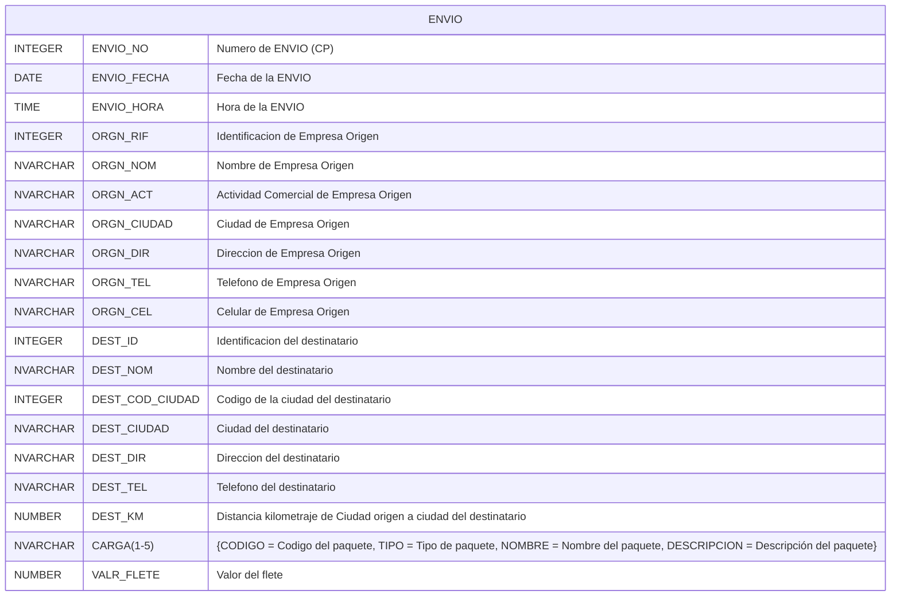
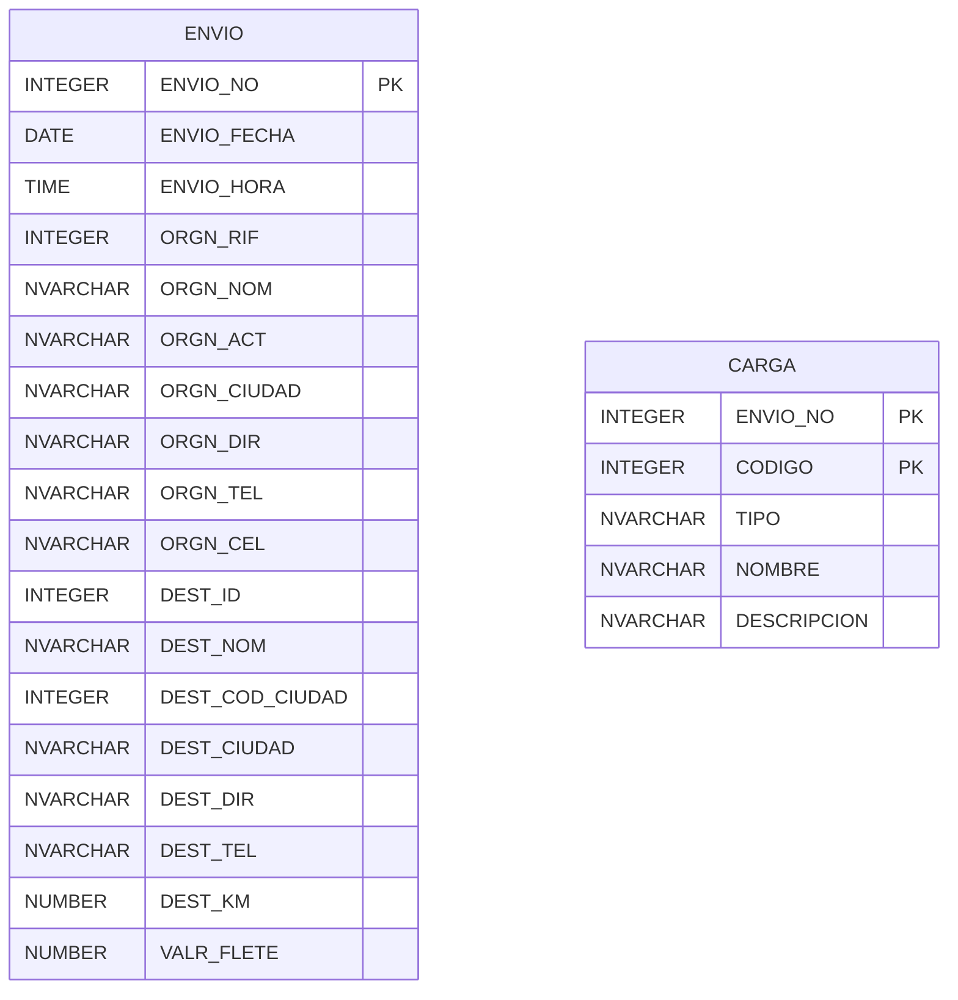
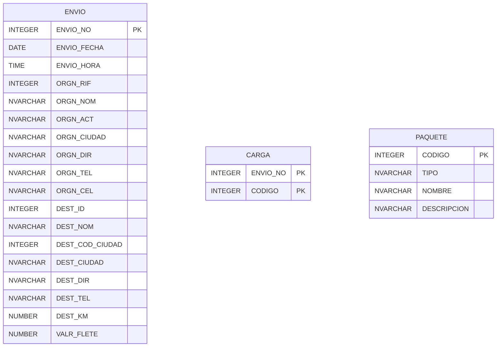
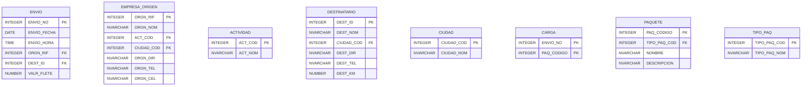

# Normalización

```mermaid
erDiagram
    ENVIO {
        INTEGER  ENVIO_NO "Numero de ENVIO (CP)"
        DATE     ENVIO_FECHA "Fecha de la ENVIO"
        TIME     ENVIO_HORA "Hora de la ENVIO"
        INTEGER  ORGN_RIF  "Identificacion de Empresa Origen"
        NVARCHAR ORGN_NOM "Nombre de Empresa Origen"
        NVARCHAR ORGN_ACT "Actividad Comercial de Empresa Origen"
        NVARCHAR ORGN_CIUDAD "Ciudad de Empresa Origen"
        NVARCHAR ORGN_DIR "Direccion de Empresa Origen"
        NVARCHAR ORGN_TEL "Telefono de Empresa Origen"
        NVARCHAR ORGN_CEL "Celular de Empresa Origen"
        INTEGER  DEST_ID "Identificacion del destinatario"
        NVARCHAR DEST_NOM "Nombre del destinatario"
        INTEGER  DEST_COD_CIUDAD "Codigo de la ciudad del destinatario"
        NVARCHAR DEST_CIUDAD "Ciudad del destinatario"
        NVARCHAR DEST_DIR "Direccion del destinatario"
        NVARCHAR DEST_TEL "Telefono del destinatario"
        NUMBER   DEST_KM "Distancia kilometraje de Ciudad origen a ciudad del destinatario"
        NVARCHAR CARGA(1-5) "{CODIGO = Codigo del paquete, TIPO = Tipo de paquete, NOMBRE = Nombre del paquete, DESCRIPCION = Descripción del paquete}"
        NUMBER   VALR_FLETE "Valor del flete"
    }
```

## FN1: Eliminar calculables y extraer grupos repetidos

```mermaid
erDiagram
    ENVIO {
        INTEGER  ENVIO_NO PK
        DATE     ENVIO_FECHA
        TIME     ENVIO_HORA
        INTEGER  ORGN_RIF
        NVARCHAR ORGN_NOM
        NVARCHAR ORGN_ACT
        NVARCHAR ORGN_CIUDAD
        NVARCHAR ORGN_DIR
        NVARCHAR ORGN_TEL
        NVARCHAR ORGN_CEL
        INTEGER  DEST_ID
        NVARCHAR DEST_NOM
        INTEGER  DEST_COD_CIUDAD
        NVARCHAR DEST_CIUDAD
        NVARCHAR DEST_DIR
        NVARCHAR DEST_TEL
        NUMBER   DEST_KM 
        NUMBER   VALR_FLETE 
    }

    CARGA {
        INTEGER  ENVIO_NO PK
        INTEGER  CODIGO PK
        NVARCHAR TIPO
        NVARCHAR NOMBRE
        NVARCHAR DESCRIPCION
    }
```

## FN2: mirar claves compuestas para desdoblar

```mermaid
erDiagram
    ENVIO {
        INTEGER  ENVIO_NO PK
        DATE     ENVIO_FECHA
        TIME     ENVIO_HORA
        INTEGER  ORGN_RIF
        NVARCHAR ORGN_NOM
        NVARCHAR ORGN_ACT
        NVARCHAR ORGN_CIUDAD
        NVARCHAR ORGN_DIR
        NVARCHAR ORGN_TEL
        NVARCHAR ORGN_CEL
        INTEGER  DEST_ID
        NVARCHAR DEST_NOM
        INTEGER  DEST_COD_CIUDAD
        NVARCHAR DEST_CIUDAD
        NVARCHAR DEST_DIR
        NVARCHAR DEST_TEL
        NUMBER   DEST_KM 
        NUMBER   VALR_FLETE 
    }

    CARGA {
        INTEGER ENVIO_NO PK
        INTEGER CODIGO PK
    }

    PAQUETE {
        INTEGER  CODIGO PK
        NVARCHAR TIPO
        NVARCHAR NOMBRE
        NVARCHAR DESCRIPCION
    }
```

## FN3: mirar dependencias entre no claves

```mermaid
erDiagram
    ENVIO {
        INTEGER ENVIO_NO PK
        DATE    ENVIO_FECHA
        TIME    ENVIO_HORA
        INTEGER ORGN_RIF FK
        INTEGER DEST_ID FK 
        NUMBER  VALR_FLETE  
    }

    EMPRESA_ORIGEN {
        INTEGER  ORGN_RIF PK
        NVARCHAR ORGN_NOM
        INTEGER  ACT_COD FK
        INTEGER  CIUDAD_COD FK
        NVARCHAR ORGN_DIR
        NVARCHAR ORGN_TEL
        NVARCHAR ORGN_CEL
    }

    ACTIVIDAD {
        INTEGER  ACT_COD PK
        NVARCHAR ACT_NOM
    }

    DESTINATARIO {
        INTEGER  DEST_ID PK
        NVARCHAR DEST_NOM
        INTEGER  CIUDAD_COD FK
        NVARCHAR DEST_DIR
        NVARCHAR DEST_TEL
        NUMBER   DEST_KM 
    }

    CIUDAD {
        INTEGER  CIUDAD_COD PK
        NVARCHAR CIUDAD_NOM
    }

    CARGA {
        INTEGER ENVIO_NO PK
        INTEGER PAQ_CODIGO PK
    }

    PAQUETE {
        INTEGER  PAQ_CODIGO PK
        INTEGER  TIPO_PAQ_COD FK
        NVARCHAR NOMBRE
        NVARCHAR DESCRIPCION
    }

    TIPO_PAQ {
        INTEGER  TIPO_PAQ_COD PK
        NVARCHAR TIPO_PAQ_NOM
    }
```
