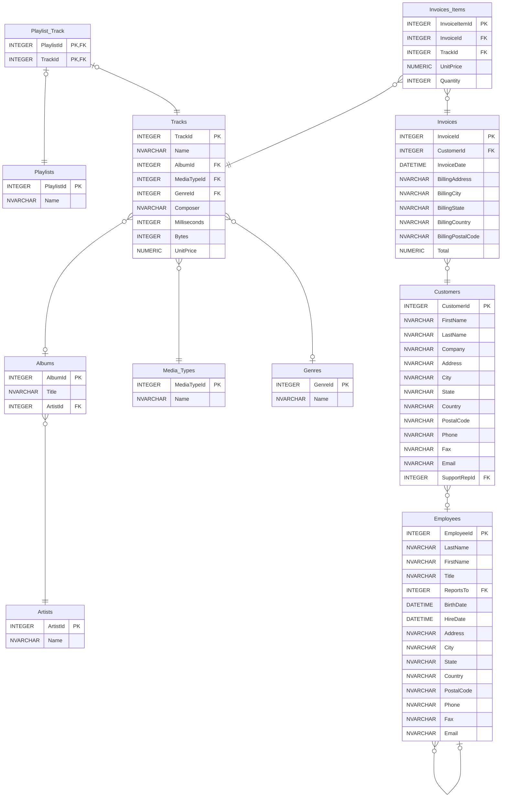

# DER Playlists

```mermaid
erDiagram
    Artists {
        INTEGER  ArtistId PK
        NVARCHAR Name
    }
    Albums }o--|| Artists : ""
    Albums {
        INTEGER  AlbumId PK
        NVARCHAR Title
        INTEGER  ArtistId FK
    }
    Media_Types {
        INTEGER  MediaTypeId PK
        NVARCHAR Name
    }
    Playlists {
        INTEGER  PlaylistId PK
        NVARCHAR Name
    }
    Genres {
        INTEGER  GenreId PK
        NVARCHAR Name
    }
    Tracks }o--|| Media_Types : ""
    Tracks }o--o| Albums : ""
    Tracks }o--o| Genres : ""
    Tracks {
        INTEGER  TrackId PK
        NVARCHAR Name
        INTEGER  AlbumId FK
        INTEGER  MediaTypeId FK
        INTEGER  GenreId FK
        NVARCHAR Composer
        INTEGER  Milliseconds
        INTEGER  Bytes
        NUMERIC  UnitPrice
    }
    Playlist_Track |o--|| Playlists : ""
    Playlist_Track |o--|| Tracks : ""
    Playlist_Track {
        INTEGER PlaylistId PK,FK
        INTEGER TrackId PK,FK
    }
    Employees }o--o| Employees : ""
    Employees {
        INTEGER  EmployeeId PK
        NVARCHAR LastName
        NVARCHAR FirstName
        NVARCHAR Title
        INTEGER  ReportsTo FK
        DATETIME BirthDate
        DATETIME HireDate
        NVARCHAR Address
        NVARCHAR City
        NVARCHAR State
        NVARCHAR Country
        NVARCHAR PostalCode
        NVARCHAR Phone
        NVARCHAR Fax
        NVARCHAR Email
    }
    Customers }o--|o Employees : ""
    Customers {
        INTEGER  CustomerId PK
        NVARCHAR FirstName
        NVARCHAR LastName
        NVARCHAR Company
        NVARCHAR Address
        NVARCHAR City
        NVARCHAR State
        NVARCHAR Country
        NVARCHAR PostalCode
        NVARCHAR Phone
        NVARCHAR Fax
        NVARCHAR Email
        INTEGER  SupportRepId FK
    }
    Invoices }o--|| Customers : ""
    Invoices {
        INTEGER  InvoiceId PK
        INTEGER  CustomerId FK
        DATETIME InvoiceDate
        NVARCHAR BillingAddress
        NVARCHAR BillingCity
        NVARCHAR BillingState
        NVARCHAR BillingCountry
        NVARCHAR BillingPostalCode
        NUMERIC  Total
    }
    Invoices_Items }o--|| Invoices : ""
    Invoices_Items }o--|| Tracks : ""
    Invoices_Items {
        INTEGER InvoiceItemId PK
        INTEGER InvoiceId FK
        INTEGER TrackId FK
        NUMERIC UnitPrice
        INTEGER Quantity
    }
```
