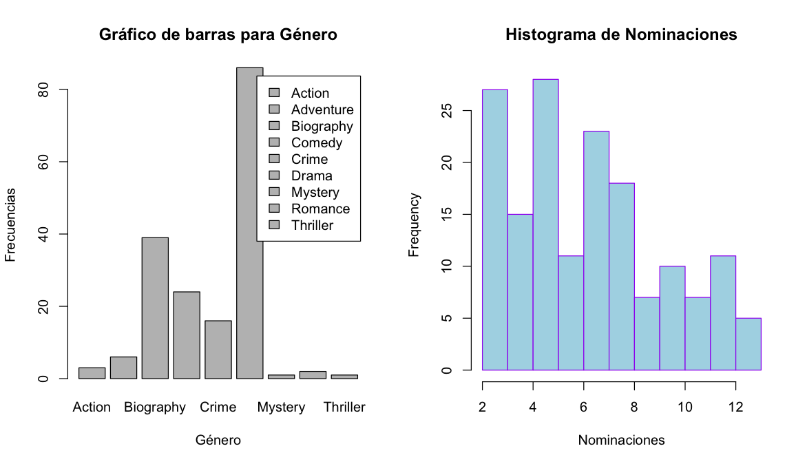
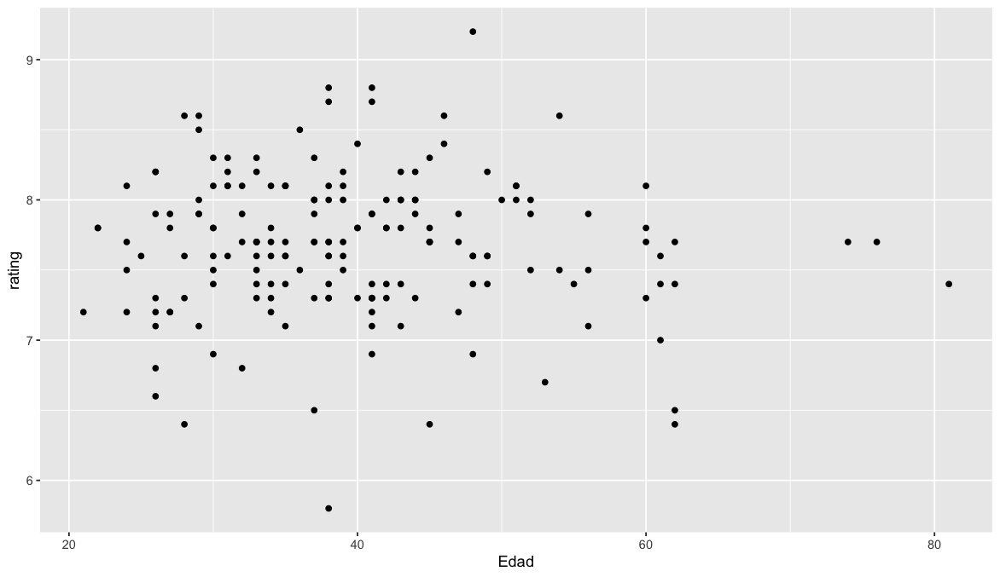
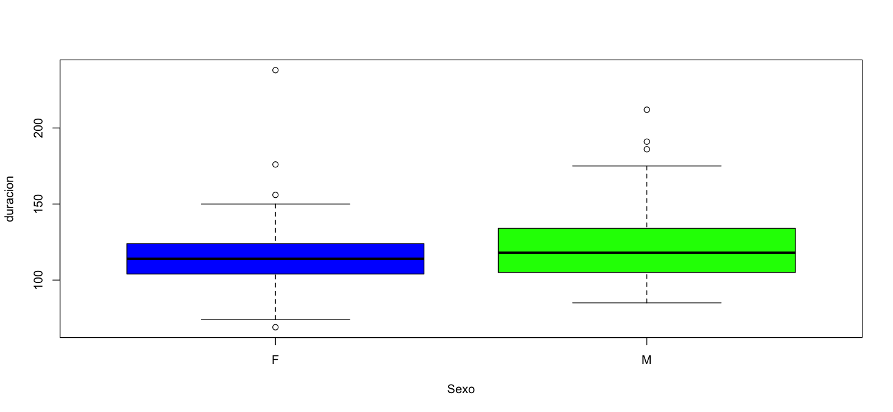

# Trabajo Práctico Nro. 1

|    |    |
| -- | -- |
| **Universidad** | Universidad Nacional del Oeste                                             |
| **Carrera**     | Esp. en Ciencia de Datos                                                   |
| **Materia**     | Fundamentos de Estadística (01050)                                         |
| **Profesor**    | Mg. Silvia Perez                                                           |
| **Alumnos**     | {Ing. Federico Czerniasky, Lic. Leandro Politano, Mg. Ing. Pablo Pandolfo} |
| **Fecha**       | Mayo 2025                                                                  |
|                 |                                                                            |

## Enunciado

* En grupos de hasta 5 personas, elegir uno de los dos datasets que están en la carpeta de clase 1: Premios ó Futbolistas
* Con el conjunto de datos elegido:
  * identificar cada una de las variables presentes (cuali, cuanti..)
  * dar medidas resúmenes de cada una, según corresponda
  * al menos para una variable de cada tipo, hacer gráficos según lo que vimos
  * PENSAR PREGUNTAS de INTERES para representarlas con gráficos o tablas

## Dataset seleccionado

* Premios.csv

## Variables

| Cualitativas |         |
| --           | --      |
| Actor        | nominal |
| Sexo         | nominal |
| Film         | nominal |
| Genero       | nominal |

| Cuantitativas |          |
| --            | --       |
| Año           | discreta |
| Edad          | discreta |
| Nominaciones  | discreta |
| Rating        | continua |
| Duración      | continua |

## Medidas resúmenes

```R
> ## TP 1
> 
> ### Borro ambiente de trabajo
> rm(list=ls())
> 
> ### Seteo directorio de trabajo
> setwd("/Users/ppando/Materias/data/materias/estadistica/tps")
> 
> ### Cargo datos del archivo Premios.csv
> datos <- read.csv("Premios.csv", header =  TRUE, sep = ";")
> 
> ### Muestro resumen
> summary(datos)
      Anio           Edad         Actor               Sexo               Film          
 Min.   :1928   Min.   :21.0   Length:178         Length:178         Length:178        
 1st Qu.:1950   1st Qu.:32.0   Class :character   Class :character   Class :character  
 Median :1972   Median :38.0   Mode  :character   Mode  :character   Mode  :character  
 Mean   :1972   Mean   :39.7                                                           
 3rd Qu.:1994   3rd Qu.:45.0                                                           
 Max.   :2016   Max.   :81.0                                                           
                                                                                       
  nominaciones        rating         duracion        genero         
 Min.   : 2.000   Min.   :5.800   Min.   : 69.0   Length:178        
 1st Qu.: 4.000   1st Qu.:7.400   1st Qu.:104.2   Class :character  
 Median : 6.500   Median :7.700   Median :115.5   Mode  :character  
 Mean   : 6.623   Mean   :7.681   Mean   :119.3                     
 3rd Qu.: 8.000   3rd Qu.:8.000   3rd Qu.:129.0                     
 Max.   :13.000   Max.   :9.200   Max.   :238.0                     
 NA's   :16                                                         
> 
```

## Gráficos

```R
### Gráficos
datos$genero <- as.factor(datos$genero)

par(mfrow = c(1, 2))

frecG <- table(datos$genero)
barplot(frecG, 
        main = "Gráfico de barras para Género", 
        xlab = "Género", 
        ylab = "Frecuencias", 
        legend = rownames(frecG))

hist(datos$nominaciones, 
     breaks = 9, 
     main = "Histograma de Nominaciones", 
     col = "lightblue",
     border = "purple", 
     xlab = "Nominaciones")
```



## Preguntas de interes

### Correlación entre la edad del actor y el rating de la película

```R
library(ggplot2)
ggplot(datos, aes(x=Edad, y=rating)) + geom_point()
```



### Distribución de duración de las películas por sexo

  ```R
  boxplot(duracion ~ Sexo, col = c("blue", "green"))
  ```

  
